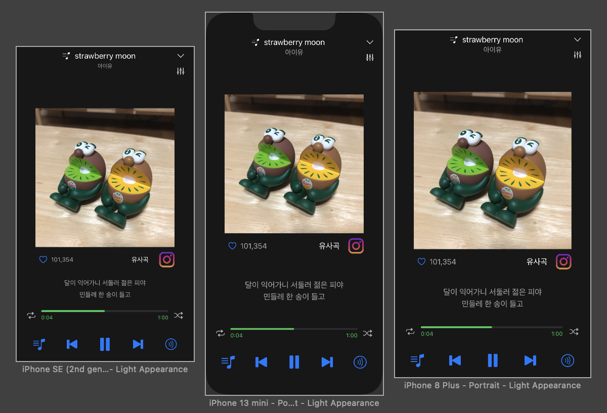

# Autolayout Practice

# 카카오 프로필 UI
|원본|레이아웃 연습|
|-|-|
|||

1. 상단 툴바는 UIView로 사이즈를 잡고, 우측 버튼 3종만 스택뷰로 묶어서 스페이싱을 동일하게 관리했다.
2. X마크는 리딩을 그냥 수퍼뷰에 붙여둠, 오른쪽 스택뷰도 트레일링을 수퍼뷰에 붙여둠
3. 중단 프로필은 이미지와 레이블을 스택뷰로 묶고 이미지 크기를 100,100으로 고정했음, 카카오 원본도 해상도에 따라 이미지 크기가 바뀌지 않았음
4. 맨 하단 버튼들은 그냥 스택뷰로 묶었음, 뷰 안에 넣었기 때문에 원하는 위치에 배치도 가능

# Melon Player UI
|원본|레이아웃 연습|
|-|-|
|||

1. 상단 현재 재생 제목의 경우 뷰로 레이아웃을 한번 더 잡고 있다. 음표 표시는 제목 레이블 리딩에 붙어있는데 뷰가 한번 감싸고 있기 때문에 제목이 과도하게 긴 경우 타이틀 레이블만 ...으로 잘리고 음표는 잘리지 않는다.
2. 이미지는 상단 뷰에 붙어있음, Aspect ratio를 1:1로 주어 트레일링, 리딩으로 디바이스 크기에 따라 1:1 비율로 커졌다 작아졌다 할 수 있음
3. 프로그래스 쪽은 프로그래스 뷰에 시간 리딩, 트레일링으로 붙이고, 뷰로 한번 묶음, 그리고 반복, 랜덤 버튼과 스택뷰로 묶음
4. 최 하단 재생 버튼들은 평범하게 스택 뷰안 버튼들

# 배민 UI

- 배민은 노코멘트