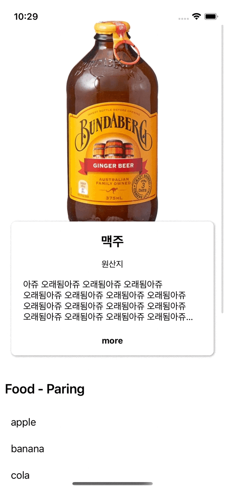

# BeerBrew

- 현재 결과물



> Reference https://youtu.be/ur7UsnCVPjc


### 20201220
- Strech 에 원리에 대해서는 어느정도 이해를 하곘음
- ImageView를 scaleAspectFill 로 두고, scroll offset값에 따라 height 값을 늘려주면 늘어지는 효과가 남
- 근데 설명 란 부분을 못하겠음.. 헤더랑 겹쳐 있어야 하는데, button에 의해서 늘어나고 줄어들기도 해야하고,, 맥주 설명 뷰 부분을 헤더에 포함시켰는데도 이상함, 

### 20201221
- layer.zPosition 으로 아래 깔린 뷰를 올리는 방법을 확인함
- animation 적용이 제대로 안되어서 방법 찾는중


- ScrollView Offset값에 따라 height 값 변경
```Swift
extension RandomBeerViewController: UIScrollViewDelegate {
  func scrollViewDidScroll(_ scrollView: UIScrollView) {
    header.imageView.snp.updateConstraints { make in
      make.height.equalTo(header.containerView.snp.height).multipliedBy(0.5).offset(-scrollView.contentOffset.y)
    }
  }
}
```

- 코드로만 뷰를 짜야하는데 뷰 확인 시 마다 빌드하는게 너무 불편해서 SwiftUI Preview 붙여홈
```Swift
#if DEBUG
import SwiftUI
struct RandomBeerViewControllerRepresentable: UIViewControllerRepresentable {
  typealias UIViewControllerType = RandomBeerViewController
  
  func makeUIViewController(context: UIViewControllerRepresentableContext<RandomBeerViewControllerRepresentable>) -> RandomBeerViewController {
    RandomBeerViewController()
  }
  
  func updateUIViewController(_ uiViewController: RandomBeerViewController, context: Context) {
    uiViewController.dummy = ["apple",
                              "banana",
                              "cola",
                              "dream",
                              "Echo",
                              "Fox",
                              "Golf",
                              "Hotel",
                              "India"]
  }
}

struct RandomBeerViewControllerPreview: PreviewProvider {
  static var previews: some View {
    RandomBeerViewControllerRepresentable()
  }
}
#endif
```
- ViewController가 아닌 View 일때도 크게 다르지 않음