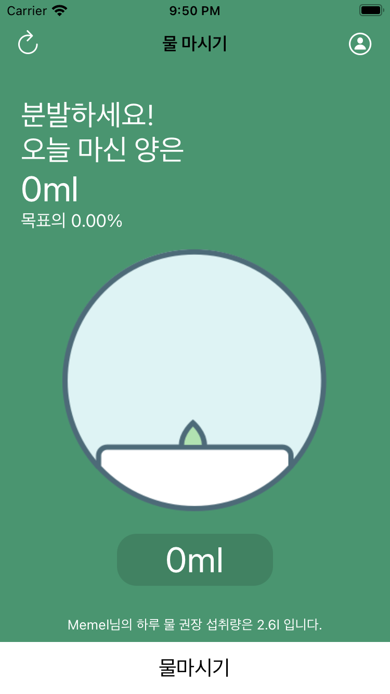
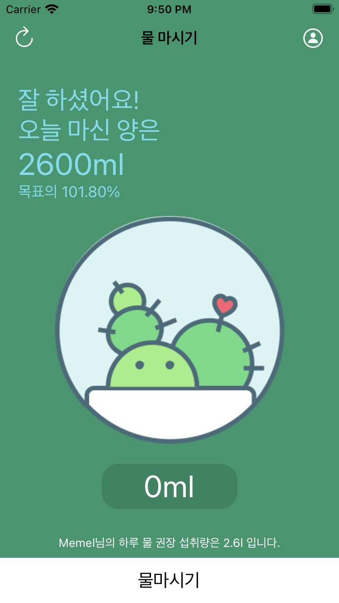
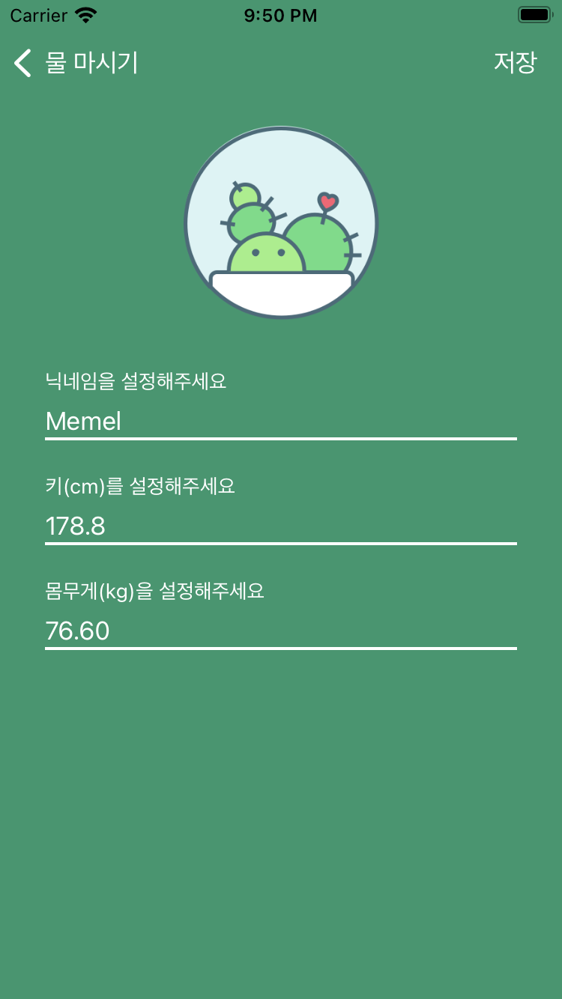

# Drink Water
## UI구성

| Main 1           | Main 2           | ProfileSetup             |
|:----------------:|:----------------:|:------------------------:|
||||

- 물 마심 진행에 따라 마신양, 목표치, 선인장 그림이 변한다.
- ProfileSetup에서는 유저 정보를 편집할 수 있다.

## Main View Controller
[전체코드](DrinkWater/View%20Controller/DrinkWaterViewController.swift)

- userManager의 userProfile이 nil인 상태에서는 앱 돌입시 메인화면을 보여주지 않고 바로 userSetup 뷰로 이동한다.
```Swift
ovveride func viewDidLoad9) {
  if userManager.userProfile == nil {
      performSegue(withIdentifier: "ProfileSetup", sender: nil)
  }
}
```
- 마실 양 물을 설정하는 부분은 그냥 UILabel로 탭했을 때 별도의 알람창으로 물 마실 양을 입력하는게 화면이 더 괜찮아 보였다.
```Swift
  //MARK: 마실 물량 설정 뷰
  @objc func inputIntakeWaterAmount() {
    let alert = UIAlertController(title: "얼마나 마셨나요?", message: nil, preferredStyle: .alert)
    alert.addTextField { waterAmount in
      waterAmount.placeholder = "\(self.intakeWaterAmountLabel.text ?? "")"
      waterAmount.keyboardType = .numberPad
    }
    let ok = UIAlertAction(title: "확인", style: .default) { _ in
      guard let text = alert.textFields?[0].text else { return }
      if !text.isEmpty {
        if let amount = Int(text) {
          self.intakeWaterAmount = amount
        }
      }
    }
    
    alert.addAction(ok)
    
    let cancel = UIAlertAction(title: "취소", style: .cancel, handler: nil)
    alert.addAction(cancel)
    
    present(alert, animated: true, completion: nil)
  }
```

## Profile Setup View Controller
[전체코드](DrinkWater/View%20Controller/ProfileViewController.swift)

- User정보가 입력되지 않아 nil상태면 뒤로가기 기능이 비활성화 된다.
```Swift
    //userProfile이 nil이면 뒤로가기 버튼 숨기기
    if userManager.userProfile == nil {
      print("userProfile nil")
      self.navigationItem.setHidesBackButton(true, animated: false)
      navigationController?.interactivePopGestureRecognizer?.isEnabled = false
    } else {
      nickNameTextField.text = userManager.userProfile?.nickName
      tallTextField.text = String(format: "%.1f", userManager.userProfile?.height ?? 0)
      weightTextField.text = String(format: "%.2f", userManager.userProfile?.weight ?? 0)
    }
```
- 유저 정보 저장시 입력된 값에 대해 최대한 검증하도록 노력했다.
- 숫자만 입력할 수 있는 조건으로 문자열을 Int로 생성했을 때 옵셔널로 선언 되는 부분을 조건문으로 처리했다.
```Swift
@IBAction func saveProfile() {
    guard let nickname = nickNameTextField.text,
            let tall = tallTextField.text,
            let weight = weightTextField.text else { return }
    
    if nickname.isEmpty || tall.isEmpty || weight.isEmpty {
      showAlert("빈칸없이 입력해 주세요")
      return
    }
    
    let tempUserTodayWaterIntake = userManager.userProfile?.todayWaterIntake ?? 0
    
    if let tallNumber = Double(tall), let weightNumber = Double(weight) {
      let setUserProfile = UserProfile(nickName: nickname, height: tallNumber, weight: weightNumber, todayWaterIntake: tempUserTodayWaterIntake, userImage: nil)
      userManager.userProfile = setUserProfile
      userManager.save()
      navigationController?.popViewController(animated: true)
    } else {
      showAlert("키와 몸무게는 숫자만 입력해 주세요!")
      return
    }
    
  }
  
  func showAlert(_ message: String) {
    let alert = UIAlertController(title: "알림", message: message, preferredStyle: .alert)
    let ok = UIAlertAction(title: "확인", style: .default, handler: nil)
    alert.addAction(ok)
    
    present(alert, animated: true, completion: nil)
  }
```

- 공부했던 것 중에 editing 도중에 허락되지 않는 값이 들어오면 타이핑 자체가 안되도록 했던 코드가 있었던 것 같은데 찾으면 적용해야 겠다.

- 각 텍스트필드에서 return키 눌렸을 시 코드
```Swift
extension ProfileViewController: UITextFieldDelegate {
  func textFieldShouldReturn(_ textField: UITextField) -> Bool {
    if nickNameTextField.isFirstResponder {
      tallTextField.becomeFirstResponder()
    } else if tallTextField.isFirstResponder {
      weightTextField.becomeFirstResponder()
    } else if weightTextField.isFirstResponder {
      saveProfile()
    }
    return true
  }
}
```
- 키보드 툴바로 다음 탭으로 넘어갈 수 있게 해주면 좋을 것 같다.

## UserProfile모델, UserProfileManager
```Swift
import Foundation

struct UserProfile: Codable {
  var nickName: String
  var height: Double
  var weight: Double
  var todayWaterIntake: Int
  var userImage: String?
  
  var recomendedIntake: Double {
    (height + weight) / 100
  }
  
}

class UserProfileManager {
  static let shared = UserProfileManager()
  var userProfile: UserProfile?
  init() {
    load()
    if userProfile == nil {
      print("UserProfile is nil")
    }
  }
  
  func save() {
    do {
      let userData = try JSONEncoder().encode(userProfile)
      UserDefaults.standard.set(userData, forKey: "\(UserProfileManager.self)")
    } catch {
      print(error.localizedDescription)
    }
  }
  
  func load() {
    do {
      if let data = UserDefaults.standard.data(forKey: "\(UserProfileManager.self)") {
        let decoded = try JSONDecoder().decode(UserProfile.self, from: data)
        userProfile = decoded
      }
    } catch {
      print(error.localizedDescription)
    }
  }
}
```
- 유저 설정 자체가 앱 환경 설정과 일맥해서 싱글톤을 사용해도 되겠다고 생각했다.
- 당장은 사용하지 않지만 설정창에서 유저 사진을 넣을 수 있게 될 것을 고려했다.
- PHPicker는 금방 적용할 수 있을 것 같다.

## 추가 구현하기
- ~~텍스트필드 키보드에 툴바 추가해서 편의성 추가~~  구현완료
- PHPicker로 유저 이미지 등록하기
- 선인장 이미지가 밋밋한데 애니매이션 추가하기
- 물 섭취량 100% 달성하면 화면에 폭죽 애니메이션이 나왔으면 좋겠다.
