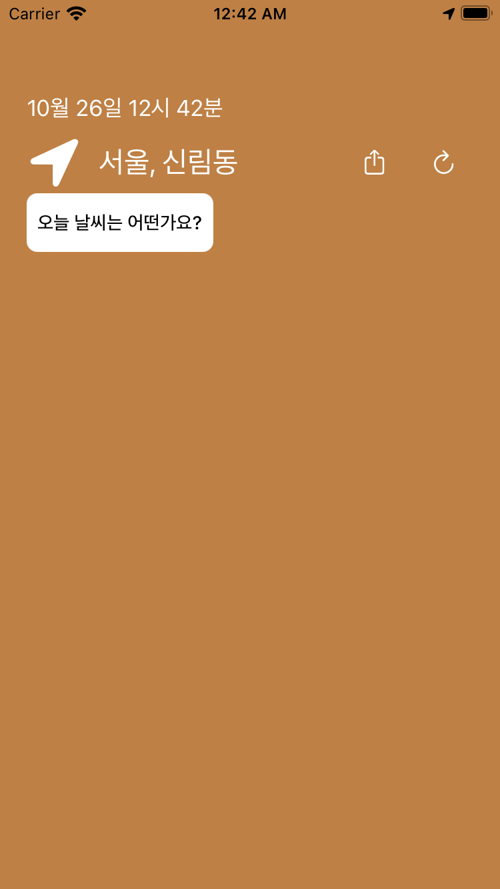

# HeyWeather

# UI
|Start|Update|
|:-:|:-:|
|||

# 구성
위치, 시간 정보를 제외한, 날씨 정보를 알려주는 부분은 콜렉션 뷰로 작성
처음에는 원하는 내용을 쉽게 추가하기 위해서 테이블 뷰로 구성했는데, 테이블 뷰는 셀 간 간격을 원할하게 주는데 문제가 있어, 결과물이 관리가 쉽지어 콜렉션 뷰로 구성함

셀 높이는 오토 디멘션으로 하고싶었는데 생각보다 잘 되지 않아 그냥 분기처리로 높이를 지정함

## Alamofire
OpenWeatherAPI 요청을 URLSession말고 Alamofire를 통해서 했는데 요청 버튼을 눌렀을 때 한번에 UI가 갱신이 되지 않았다.

디버깅으로 분석했을 때, (당연하지만)요청이 완료 된 뒤 데이터가 저장되면 콜렉션 뷰를 리로드 해야 하는데 순서 보장이 되지 않아, 데이터가 들어오기전에 리로드 해버림, 디스패치 큐 쓰면 될 것 같은데 일단 안됐음, Alamofire 사용법을 정확히 익힌 다음에 수정하는게 시간 낭비가 덜할 듯

```Swift
func fetchWeatherData(_ coordinate: CLLocationCoordinate2D) {
    var baseURL = URLComponents(string: "https://api.openweathermap.org/data/2.5/weather")
    let latitudeQuery = URLQueryItem(name: "lat", value: coordinate.latitude.description)
    let longitudeQuery = URLQueryItem(name: "lon", value: coordinate.longitude.description)
    let lang = URLQueryItem(name: "lang", value: "kr")
    let units = URLQueryItem(name: "units", value: "metric")
    
    guard let apiKey = apiKey else { print("api key is empty"); return}
    let apiKeyQuery = URLQueryItem(name: "appid", value: apiKey)
    
    baseURL?.queryItems = [latitudeQuery, longitudeQuery, lang, units, apiKeyQuery]
    
    guard let url = baseURL?.url else { print("url build fail"); return }
    
    AF.request(url, method: .get).validate().responseJSON { response in
      switch response.result {
      case .success(let value):
        let json = JSON(value)
        self.weatherTranslater(data: json)
      case .failure(let error):
        print(error.localizedDescription)
      }
    }
  }
```


## SwiftyJSON
이거 편한거 맞음?? 편하게 쓰는 법이 따로 있는건가
```Swift
private func weatherTranslater(data: JSON) {
    weatherData.removeAll()
    let temp = data["main"]["temp"].double
    weatherData.append("지금은 \(String(format: "%.1f", temp ?? 0))℃ 에요!")
    
    let humidity = data["main"]["humidity"]
    weatherData.append("\(humidity)% 만큼 습해요!")
    
    let wind = data["wind"]
    weatherData.append("\(wind["deg"]) 방향으로 \(wind["speed"])m/s의 속도로 바람이 불어요")
    
    let weather = data["weather"][0]
    
    weatherData.append("https://openweathermap.org/img/wn/\(weather["icon"])@2x.png")
    weatherData.append("행복한 하루 보내세요")
    
}
```
