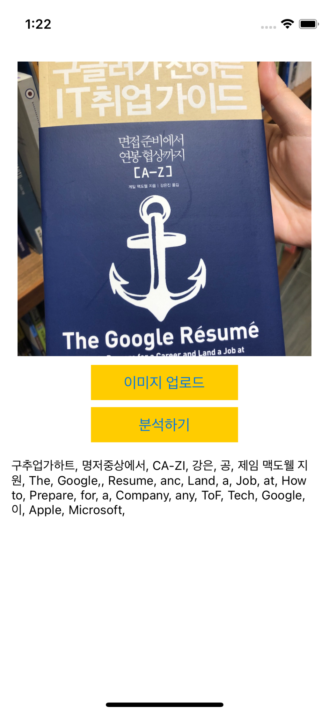
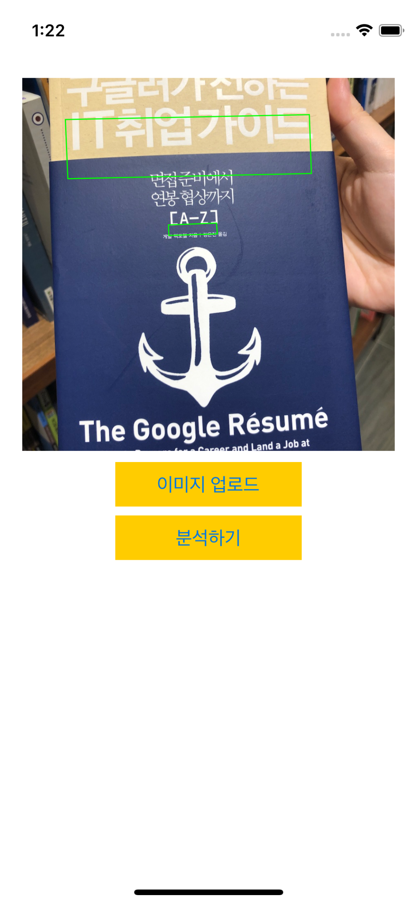

# KAKAO OCR

1. KAKAO OCR로 이미지를 보내면, 분석 결과를 받는다.



2. 이미지 업로드는 PHPickerView로 구현했는데, 서버로 보내면 이미지 사이즈 때문에 실패해서 온다. 이미지 사이즈 줄이는 법은.. 추후에 공부해봐야 겠다.

3. 이미지 사이즈는 충분히 공통제약 조건에 들어가는데 '구글러가 전하는'은 인식이 안된다. 사이즈를 1:1로만 보는 듯 하다.

4. 받은 좌표로 박스처리도 해볼려고 했는데 받은 좌표에 따라 표시해도 위치가 다르게 나온다. 아직 이유는 모르겠다

```Swift
class BoxView: UIView {
  override func draw(_ rect: CGRect) {
    super.draw(rect)
    guard let context = UIGraphicsGetCurrentContext() else { return }
    context.setStrokeColor(UIColor.green.cgColor)
    context.setLineWidth(1)
//
//    //335
////    105:1024 = x :335
////    1024x = 105*335
////    x = 105*335/1024
//
    let xRatio = 335.0 / 907
    let yRatio = 335.0 / 1210


    context.move(to: .init(x: 105 * xRatio, y:  135 * yRatio))
    context.addLine(to: .init(x: 699 * xRatio, y: 119 * yRatio))
    context.addLine(to: .init(x: 704 * xRatio, y: 310 * yRatio))
    context.addLine(to: .init(x: 111 * xRatio, y: 327 * yRatio))
    context.closePath()
    context.strokePath()
```