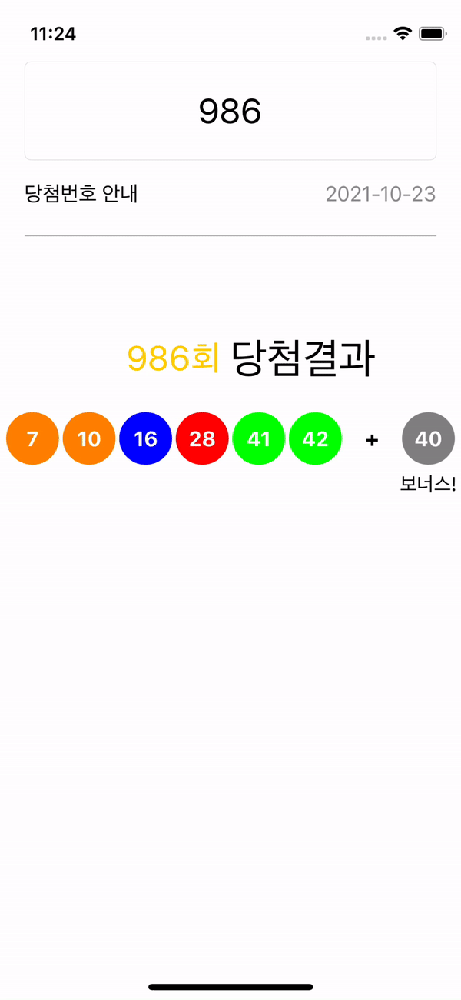

# 로또 당첨번호 검색기

- 자동으로 최신 게임을 가져온다.
- 입력 필드를 선택하면 게임 회차 선택 피커가 보인다.


## 앱 실행시 자동으로 최신게임 업데이트
- 어떤 방법이 있을까 하다가, 로또 홈페이지 당첨결과 페이지 HTML을 통째로 가져와서 파싱하기로 했다.

```Swift
  func updateLotteryData() {
    let url = URL(string: "https://dhlottery.co.kr/gameResult.do?method=byWin")!
    
    var request = URLRequest(url: url)
    request.method = .get
    URLSession(configuration: .default).dataTask(with: request) { data, response, error in
      if let data = data {
        let encodingEUCKR = CFStringConvertEncodingToNSStringEncoding(0x0422)
        let context = String(data: data, encoding: String.Encoding(rawValue: encodingEUCKR))!
        print(context)
        let substring = #"content="동행복권 986"#
        
        let range = context.range(of: substring)!
        
        var content = context[range]
        
        while let current = content.first {
          if current == " " {
            content.removeFirst()
            break
          } else {
            content.removeFirst()
          }
        }
        DispatchQueue.main.async {
          if let lastGame = Int(content) {
            self.lotteryCount = .init(1...lastGame)
          } else {
            print("Last Game load fail")
          }
        }
      }
    }.resume()
  }
```

- 처음에 data를 utf8로 인코딩 했는데 nil이 나와서 인코딩 이것저것 다 돌려봤는데 깨지더라, 그래서 알아보니 홈페이지 Content-Type이 EUC-KR이었고, 따로 인코딩 값을 생성해 주지 않으면 맞는게 없었다. 
`let encodingEUCKR = CFStringConvertEncodingToNSStringEncoding(0x0422)`를 통해서 0x0422가 EUC-KR인것도 알았고, `CFStringConvertEncodingToNSStringEncoding`을 통해서 기존에 없던 인코딩 타입도 생성할 수 있다는 것을 알았다.