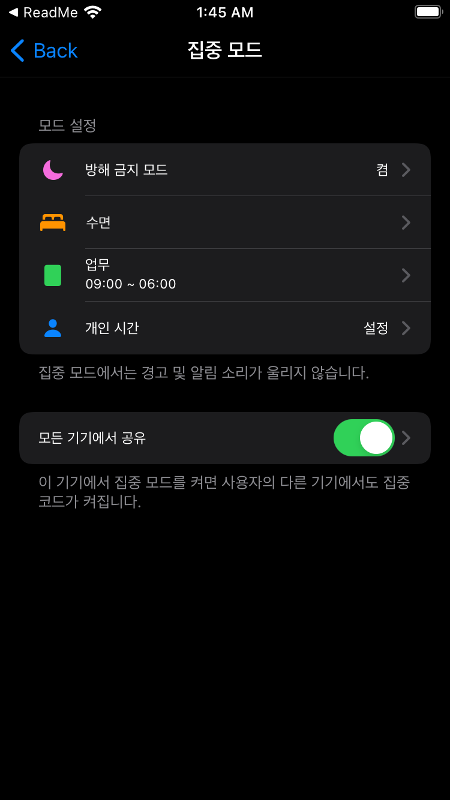
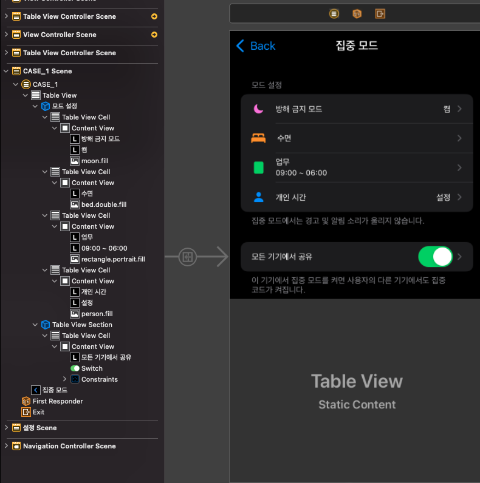
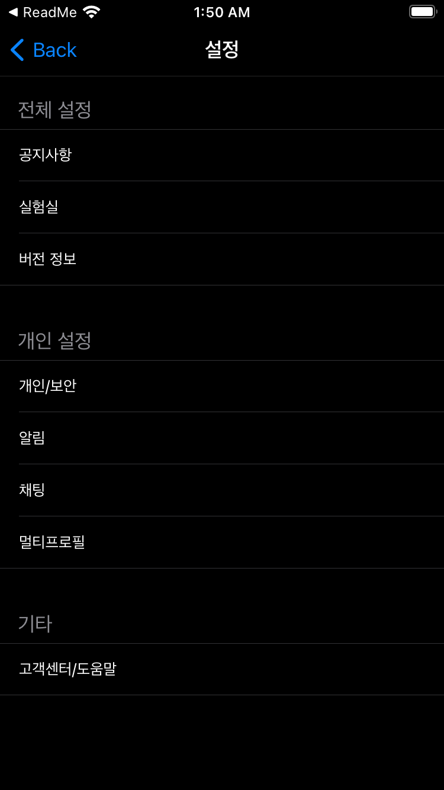
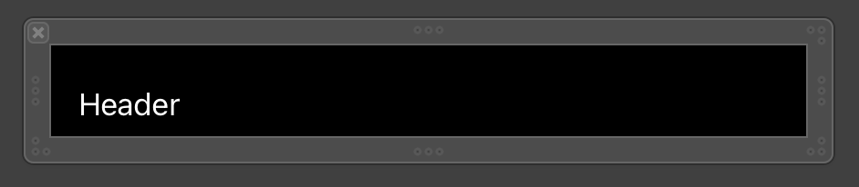
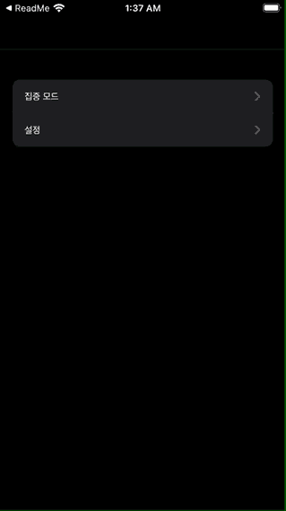

# 테이블 뷰 컨트롤러 구성하기

## Case 1 스토리보드로만 구현하기
|Case 1|Case 1 Detail|
|:-:|:-:|
|||

특별히 어려움 없이 구현 완료
업무의 SF Symbol이 clipboard라는 이름으로 있을 것 같은데 없다. doc on clipboard 같은건 있는데...

## Case 2 프로토타입 셀을 이용한 코드로 테이블 뷰 구성
|Case 2|
|:-:|
||

### Model
```Swift
struct Settings {
  let category: Category
  let list: [String]
}

enum Category: String, CaseIterable {
  case 전체설정 = "전체 설정"
  case 개인설정 = "개인 설정"
  case 기타 = "기타"
}
```
- 따로 파일은 만들지 않고 `SettingsViewController.swift`에 같이 작성함

### Data Source
```Swift
//MARK: - DataSource
extension SettingsViewController {
  override func numberOfSections(in tableView: UITableView) -> Int {
    settings.count
  }
  
  override func tableView(_ tableView: UITableView, numberOfRowsInSection section: Int) -> Int {
    return settings[section].list.count
  }
  
  override func tableView(_ tableView: UITableView, cellForRowAt indexPath: IndexPath) -> UITableViewCell {
    let cell = tableView.dequeueReusableCell(withIdentifier: "SettingsCell", for: indexPath)
    
    guard let textLabel = cell.viewWithTag(1000) as? UILabel else { fatalError("Connect fail UILabel")}
    textLabel.font = .systemFont(ofSize: 13)
    textLabel.text = settings[indexPath.section].list[indexPath.row]
    
    return cell
  }
  
  
//  override func tableView(_ tableView: UITableView, titleForHeaderInSection section: Int) -> String? {
//    return settings[section].category.rawValue
//  }
    
}
```
- header를 `titleForHeaderInSection`으로 처음에는 구현했다가 Cell에서 바로 titleLabel 접근이 15부터 deprecated되어 다른 방법으로 사용하기 위해 주석 처리 했다. 

### Delegate
```Swift
//MARK: - Delegate
extension SettingsViewController {
  override func tableView(_ tableView: UITableView, heightForHeaderInSection section: Int) -> CGFloat {
    return 45
  }
  
//  override func tableView(_ tableView: UITableView, viewForHeaderInSection view: UIView, forSection section: Int) {
//    guard let headerView = view as? UITableViewHeaderFooterView else { return }
//    headerView.textLabel?.textColor = .secondaryLabel
//    headerView.textLabel?.font = .systemFont(ofSize: 15)
//  }
  
  override func tableView(_ tableView: UITableView, viewForHeaderInSection section: Int) -> UIView? {
    guard let headerView = tableView.dequeueReusableHeaderFooterView(withIdentifier: SettingsHeaderView.reuseIdentifier) as? SettingsHeaderView else { return nil}
    
    headerView.titleLabel.text = Category.allCases[section].rawValue
    headerView.titleLabel.textColor = .secondaryLabel
    return headerView
  }
}
```
textLabel의 컬러와 사이즈를 `willDisplayHeaderView` 에서 가능 하길래 이걸로 하려고 했는데 textLabel접근이 15.0부터 deprecated되어 별도의 헤더 뷰를 만들어서 넣기로 했다.

|SettingsHeaderView.xib|
|:-:|
|

특별한 것은 없지만 xib으로 우선 만든 후
```Swift
  override func viewDidLoad() {
    super.viewDidLoad()
    
    let headerViewNibName = UINib(nibName: "\(SettingsHeaderView.self)", bundle: nil)
    tableView.register(headerViewNibName, forHeaderFooterViewReuseIdentifier: SettingsHeaderView.reuseIdentifier)
    
  }
```
viewDidLoad에서 등록하여 `viewForHeaderInSection`에서 데이터 전달과 텍스트 컬러를 전달했다.

|실행화면|
|:-:|
|