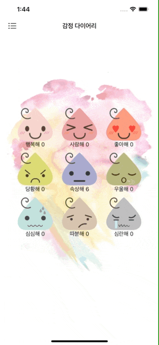

# Emotion Diary

# 스토리보드 구성


슬라임 이미지와 레이블은 사진과 같이 스텍뷰를 중첩해서 만들었다.

이 전체 스택뷰 사이즈를 뷰를 하나더 추가해 스택뷰들을 감싸서 최종 사이즈를 결정했다.

# View Controller

해당 앱은 페이지가 하나인 어플리케이션으로 뷰컨트롤러에서 모두 이루어 졌다.

```swift
import UIKit

class ViewController: UIViewController {
  
	//1
  @IBOutlet var emotionImageViewCollection: [UIImageView]!
  @IBOutlet var emotionLableViewCollection: [UILabel]!
  @IBOutlet var emotionStackViewCollection: [UIStackView]!
  
	//2
  let manager = EmotionManager()
  
  override func viewDidLoad() {
    super.viewDidLoad()
    
		//3
    navigationController?.navigationBar.backgroundColor = .clear
    navigationController?.navigationBar.setBackgroundImage(UIImage(), for: .default)
    navigationController?.navigationBar.shadowImage = UIImage()
    
    
		//4
    if manager.emotions.count == emotionImageViewCollection.count {
      for (emotion, eachView) in zip(manager.emotions, emotionImageViewCollection) {
        eachView.image = emotion.image
      }
      for (emotion, eachView) in zip(manager.emotions, emotionLableViewCollection) {
        eachView.text = "\(emotion.emotionState.rawValue) \(emotion.emotionCount)"
        eachView.font = eachView.font.withSize(15)
        eachView.textColor = .black
      }
    }
    
		//5
    for (idx, stackView) in emotionStackViewCollection.enumerated() {
      let tapGesture = StackViewTapGesture(target: self, action: #selector(tappedEmotion(sender:)))
      tapGesture.idx = idx
      stackView.addGestureRecognizer(tapGesture)
    }
    
  }
  
	//6
  @objc func tappedEmotion(sender: StackViewTapGesture) {
    guard let idx = sender.idx else { return }
    manager.emotions[idx].emotionCount += 1
    updateLable(for: idx)
    
    //7
    let origin = emotionImageViewCollection[idx].center.x
    UIView.animate(withDuration: 0.8, delay: 0.0, usingSpringWithDamping: 0.2, initialSpringVelocity: 0.0, options: [], animations: {
      self.emotionImageViewCollection[idx].center.x += 10
    }, completion: nil)
    emotionImageViewCollection[idx].center.x = emotionImageViewCollection[idx].center.x != origin ? origin : emotionImageViewCollection[idx].center.x
    
    
  }
  
	//8
  func updateLable(for idx: Int) {
    let emotion = manager.emotions[idx]
    emotionLableViewCollection[idx].text = "\(emotion.emotionState.rawValue) \(emotion.emotionCount)"
    manager.save()
  }
}

//9
class StackViewTapGesture: UITapGestureRecognizer {
  var idx: Int?
}
```

1. UI 객체들을 Collection Outlet으로 묶었다. 이를 통해 중첩된 UI들을 한번에 처리하고자 했다.
2. Emotion 모델을 관리하는 인스턴스로 추후에 설명
3. Navigation바가 투명하길 원했다.
4. Emotion 모델은 총 9개이고 뷰들도 총 9세트 이므로 이를 Zip 메소드를 활용해 UI들의 세부적인 코드를 작성했다.
5. UI 객체들을 UIButton으로 생성한 것이 아니라 StackView로 감싸고 있어 제스처를 등록해주고자 했다. 이 과정에서 #selector의 경우 인자를 전달할 수가 없어서 방법을 찾던 중 GestureRecognizer를 상속하여 전달하고자 하는 프로퍼티를 추가하면 인자를 전달 할 수 있다는 것을 알았다. 9번이 그 코드이다.
6. 각 UI객체들이 탭 되었을 시 레이블을 업데이트 하고 실제 데이터 모델에 변경된 값을 전달한다.
7. 슬라임들을 탭 했을 때 너무 밋밋해서 좌우로 흔들리길 바랬다. 찾아보니 Sptring Animation으로 해당 동작을 구현 가능했다., 이 과정에서 슬라임의 원래 위치를 저장했다가 애니메이션이 끝나면 다시 돌려놓는 코드를 추가했는데, 탭을 빠르고 많이 하게 되면 간혹 슬라임이 원래 위치로 돌아오지 않는 버그가 있었다. 여러번 더 누르면 원래 위치로 돌아오긴 했지만 보기가 좋지 않아서 원래 위치로 초기화 시키는 코드를 추가했다.
8. 레이블을 갱신하는 메소드, 이 과정에서 Emotion 모델을 저장한다.
9. GestureRecognizer 상속

# Emotion Model, Emotion State

```swift
public struct Emotion: Codable {
  let emotionState: EmotionState
  var emotionCount: Int = 0
  
  var image: UIImage {
    UIImage(named: emotionState.getImageName()) ?? UIImage()
  }
}
```

```swift
enum EmotionState: String, CaseIterable, Codable {
  case 행복해
  case 사랑해
  case 좋아해
  case 당황해
  case 속상해
  case 우울해
  case 심심해
  case 따분해
  case 심란해
  
  func getImageName() -> String {
    switch self {
    case .행복해:
      return "mono_slime1"
    case .사랑해:
      return "mono_slime2"
    case .좋아해:
      return "mono_slime3"
    case .당황해:
      return "mono_slime4"
    case .속상해:
      return "mono_slime5"
    case .우울해:
      return "mono_slime6"
    case .심심해:
      return "mono_slime7"
    case .따분해:
      return "mono_slime8"
    case .심란해:
      return "mono_slime9"
    }
  }
}
```

- Emotion은 슬라임을 추상화 한것으로 감정 상태와 감정을 탭한 횟수, 그리고 이미지 이름을 편리하게 리턴하기 위한 프로퍼티가 존재한다.
- EmotionState는 9개의 감정을 편리하게 작성하기 위함으로 초기화를 위해 RawValue와 CaseIterable을 사용했다.
- 두 모델 모두 Codable을 채용하는데 이는 UserDefaults를 통해 데이터를 저장하고 불러오기 위함

# Emotion Manager

- Emotion Manager는 Emotion 모델을 생성, 저장, 불러오기 기능을 관리하는 클래스

```swift
import Foundation
class EmotionManager {
  var emotions: [Emotion] = []
  
  init() {
    load()
    if emotions.isEmpty {
      for state in EmotionState.allCases {
        let emotion = Emotion(emotionState: state)
        emotions.append(emotion)
      }
    }
  }
  
  func save() {
    do {
      let emotionData = try JSONEncoder().encode(emotions)
      UserDefaults.standard.set(emotionData, forKey: "\(EmotionManager.self)")
    } catch {
      print(error.localizedDescription)
    }
  }
  
  func load() {
    do {
      if let data = UserDefaults.standard.data(forKey: "\(EmotionManager.self)") {
        let decoded = try JSONDecoder().decode([Emotion].self, from: data)
        emotions = decoded
      }
    } catch {
      print(error.localizedDescription)
    }
  }
  
}
```

- 클래스가 인스턴스화 됐을 때 load() 메소드를 호출하는데 UserDefaults plist를 JSON Decoder를 통해 모델로 변환시켰다.
- 이 과정에서 emotions이 비어있으면 저장된 적이 없는 것으로 판단해 emotions를 초기값으로 만든다.
- save 메소드는 load와 똑같이 JSONEncoder를 통해 Data로 변환 후 UserDefaults를 사용하여 저장했다. (근데 이렇게 까지 하면 그냥 Plist로 저장하는 거랑 다를 거 없지 않나?)


