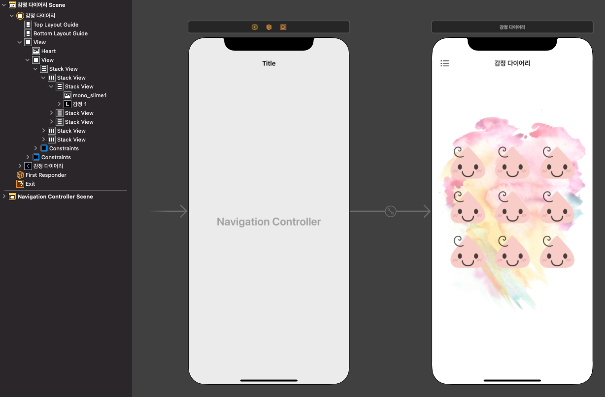

# Anniversary Counter
# 스토리보드 구성

Dday를 나타내는 디데이, 날짜 이미지 뷰를 포함해 뷰로 틀을 고정한 뒤 스택뷰로 잡았다.

# Main View Controller
```Swift
import UIKit

class MainViewController: UIViewController {

  @IBOutlet weak var datePicker: UIDatePicker!
  @IBOutlet var dDayLabels: [UILabel]!
  @IBOutlet var dDayImageViews: [UIImageView]!
  @IBOutlet var targetDates: [UILabel]!
  @IBOutlet var capsuleViews: [UIView]!
  
  var dDayManager = DdayManager()
  
  override func viewDidLoad() {
    super.viewDidLoad()
    
    dDayManager.load()
    
    //Calendar
    if #available(iOS 14.0, *) {
      datePicker.preferredDatePickerStyle = .inline
    }
    
    //dDayCapule UI
    for (idx, capsule) in capsuleViews.enumerated() {
      capsule.layer.cornerRadius = capsule.frame.width / 8
      capsule.clipsToBounds = true
      
      let tapGesture = DdayViewTapGesture(target: self, action: #selector(dDaySetup(sender:)))
      tapGesture.idx = idx
      capsule.addGestureRecognizer(tapGesture)
    }
    
    updateUI()
  }
  
  @objc func dDaySetup(sender: DdayViewTapGesture) {
    guard let idx = sender.idx else { return }
    let alert = UIAlertController(title: "디데이설정", message: nil, preferredStyle: .alert)
    
    alert.addTextField { afterDay in
      afterDay.placeholder = "숫자만 입력하세요"
      afterDay.keyboardType = .numberPad
    }
    
    alert.addTextField { color in
      color.placeholder = "#FFFFFF"
      color.text = "#"
    }
    
    let ok = UIAlertAction(title: "확인", style: .default) { _ in
      let afterDay = alert.textFields?[0].text ?? ""
      let color = alert.textFields?[1].text ?? ""
      
      if let intAfterDay = Int(afterDay) {
        self.dDayManager.ddays[idx].dday = intAfterDay
      }
      
      if color.count == 7 {
        self.dDayManager.ddays[idx].backgroundColor = color
      }
      
      self.updateUI()
      
    }
    alert.addAction(ok)
    
    let cancel = UIAlertAction(title: "취소", style: .cancel, handler: nil)
    alert.addAction(cancel)
    
    present(alert, animated: true, completion: nil)
    
  }
  
  //UI Reset
  func updateUI() {
    //dDayImageView UI
    for (imageView, dday) in zip(dDayImageViews, dDayManager.ddays) {
      let ddayColor = dday.backgroundColor
      imageView.backgroundColor = UIColor(hexString: ddayColor)
    }
    
    //dDayLabel UI
    for (dDaylabel, dday) in zip(dDayLabels, dDayManager.ddays) {
      dDaylabel.text = dday.ddayText
    }
    
    //dDayTargetDates UI
    for (dDayTarget, dday) in zip(targetDates, dDayManager.ddays) {
      dDayTarget.text = dday.targetDateText
    }
    dDayManager.save()
  }
  
  
  //MARK: - IBActions
  @IBAction func changedDatePicker(_ sender: UIDatePicker) {
    for idx in dDayManager.ddays.indices {
      dDayManager.ddays[idx].targetDate = sender.date
    }
    updateUI()
  }
  
}

class DdayViewTapGesture: UITapGestureRecognizer {
  var idx: Int?
}
```
- 하위 뷰들을 감싸고 있는 상위 뷰는 subviews로 접근할 수 있는 것을 알았지만 데이터 모델과 함께 활용하기 위해서는 플랫하게 만들고 타입 캐스팅도 해야해서 생각보다 번거로웠다. 개체 많지 않으니 아웃렛 콜렉션으로 만들었다.
- 디디에 표시 뷰의 각 항목을 탭하면 Dday 기준일과 배경색을 바꿀 수 있다. 커스텀 뷰를 isHidden을 통해 표시할까 했는데 정확히 어떻게 하는 지 몰라 공부가 정확히 되면 하기로 하고 AlertController 텍스트 필드를 활용해보았다. \

# Dday Model
```Swift
import Foundation

struct DDay: Codable {
  var targetDate: Date
  var dday: Int
  var backgroundColor: String
  
  var targetDateText: String {
    let remainDay = Date(timeInterval: Double(dday * 60 * 60 * 24), since: targetDate)
    let formatter = DateFormatter()
    formatter.dateFormat = "yyyy년\nMM월dd일"
    return formatter.string(from: remainDay)
  }
  
  var ddayText: String {
    return dday > 0 ? "D+\(dday)" : "D-\(dday)"
  }
}
```
- DDay모델은 기준일과 디데이일, 백그라운드 컬러를 속성으로 갖는다.

# DDay Manager
```Swift
import Foundation

class DdayManager {
  var ddays: [DDay] = []
  
  init () {
    load()
    
    if ddays.isEmpty {
      ddays = [
        DDay(targetDate: Date(), dday: 100 , backgroundColor: "#EC007F"),
        DDay(targetDate: Date(), dday: 200, backgroundColor: "#EC007F"),
        DDay(targetDate: Date(), dday: 300, backgroundColor: "#EC007F"),
        DDay(targetDate: Date(), dday: 400, backgroundColor: "#EC007F")
      ]
    }
  }
  
  func save() {
    do {
      let ddaysData = try JSONEncoder().encode(ddays)
      UserDefaults.standard.set(ddaysData, forKey: "\(DdayManager.self)")
    } catch {
      print(error.localizedDescription)
    }
  }
  
  func load() {
    do {
      if let data = UserDefaults.standard.data(forKey: "\(DdayManager.self)") {
        let decoded = try JSONDecoder().decode([DDay].self, from: data)
        ddays = decoded
      }
    } catch {
      print(error.localizedDescription)
    }
  }
  
}
```
- 특별한 건 없다. 초기화, 로드, 저장을 관리함

# UIColor Hex init
```Swift
import UIKit

///HEX 값으로 UIColor를 생성하는 생성자 오버로딩
///패턴은 #부터 시작해서 총 7글자여야 한다.
///예 #EC007F (대소문자는 상관하지 않음)
extension UIColor {
  convenience init(hexString: String, alpha: CGFloat = 1.0) {
    var validate = hexString
    if validate.first != "#"  {
      validate = "#000000"
    }
    
    var cutting = validate.map{$0}
    cutting.removeFirst()
    
    let r = String(cutting[0...1])
    let g = String(cutting[2...3])
    let b = String(cutting[4...5])
    
    let redInt = CGFloat(Int(r, radix: 16) ?? 0) / 255.0
    let greenInt = CGFloat(Int(g, radix: 16) ?? 0) / 255.0
    let blueInt = CGFloat(Int(b, radix: 16) ?? 0) / 255.0
    
    self.init(red: redInt, green: greenInt, blue: blueInt, alpha: alpha)
  }
}
```
Dday 인스턴스를 생성할 때 백그라운드 컬러를 핵사 코드로 생성하고 싶어서 따로 생성자를 만듦
