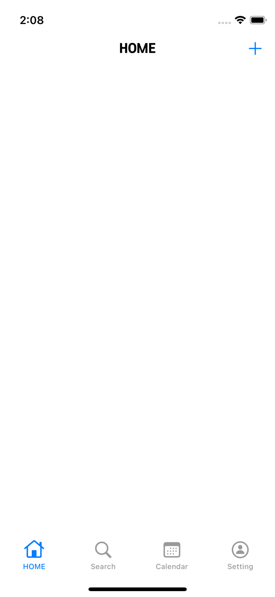
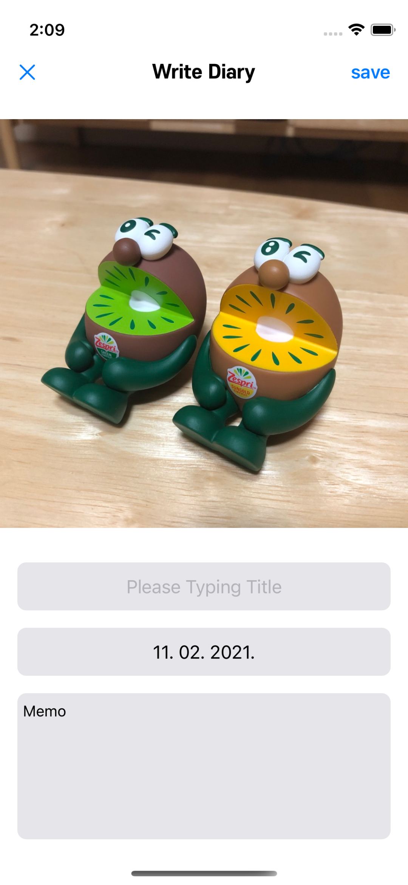
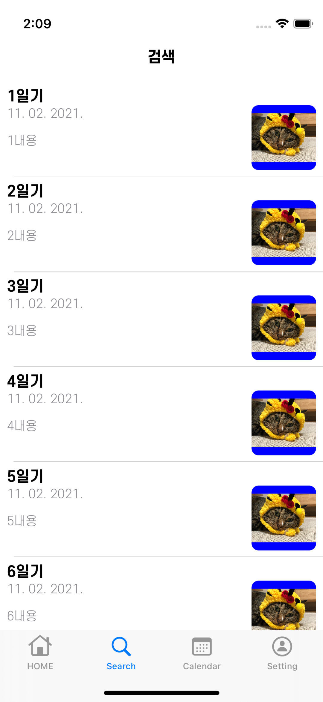
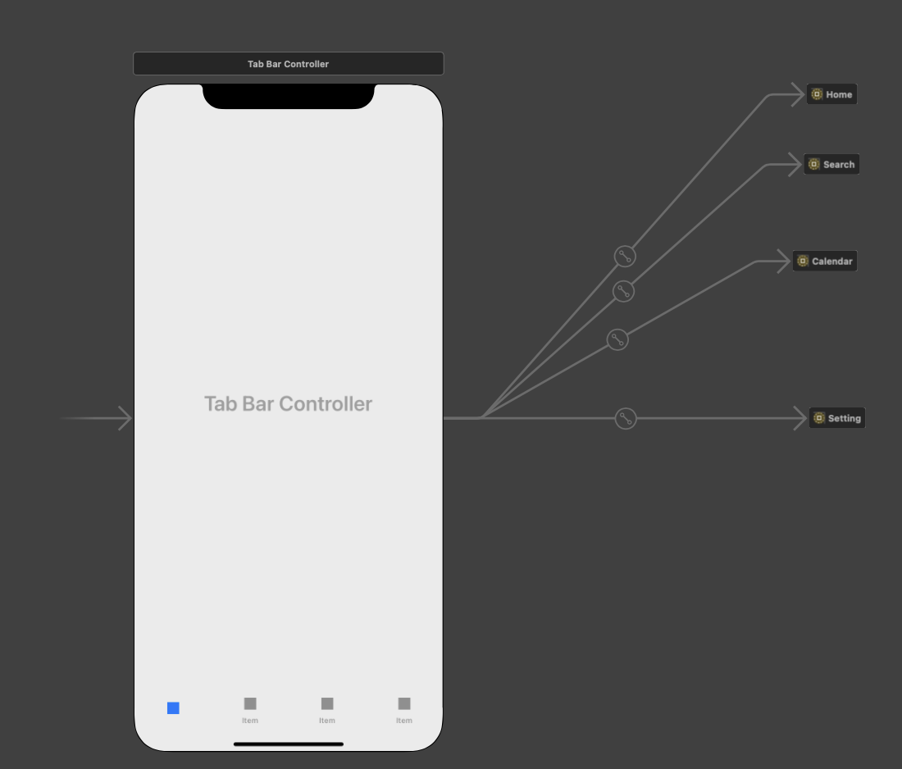

# SeSAC 6WEEk Project Assignment

# UI구성
|Home|AddView|ListView|
|:-:|:-:|:-:|
||||

# Storyboard Reference
- Storyboard Referece로 각 뷰들을 별개의 스토리보드로 연결했는데 탭바랑 같이 사용 시 연결하는 방법이 정리가 되었다.

- 이처럼 root를 tab bar controller로 하고 각 래퍼런스를 root로 연결
- 각 뷰컨트롤러에서는(또는 스토리보드) 탭바 아이템을 설정하고 싶으면 TabBar Item을 넣어주고 거기서 커스텀 해주면 Home사진과 같이 잘 표시가 된다.

# NavigationBar
- NavigationBar를 스토리보드로 추가해도 되지만 AddView의 경우 modal Present 형태라 전체 네비게이션을 통일해주기 위해 코드로 작성했다.
- 네비게이션 바 경계 라인을 없앨 때는 `backgroundImage`와, `shadowImage`를 UIImage()로 넣어주면 없어지고, 코드로 생성한 navigationBar가 세이프에리어 쪽까지 채워지지 않는데 이 경우는 `UINavigationBarDelegate`에서 `position`을 `.topAtteched`로 하면 해결됐다.
```Swift
private func navigationBarSetup() {
    let navigationBar = UINavigationBar(frame: .init(x: 0, y: 44, width: view.frame.width, height: 44))
    navigationBar.delegate = self
    navigationBar.titleTextAttributes = [NSAttributedString.Key.font: UIFont.mainExtraBold]
    navigationBar.setBackgroundImage(UIImage(), for: .default)
    navigationBar.shadowImage = UIImage()
    
    view.addSubview(navigationBar)
    
    let customNavigationItem = UINavigationItem(title: "HOME")
    let addItem: UIBarButtonItem = .init(barButtonSystemItem: .add, target: self, action: #selector(showAddViewController))
    
    customNavigationItem.rightBarButtonItem = addItem
    navigationBar.setItems([customNavigationItem], animated: false)
  }

extension HomeViewController: UINavigationBarDelegate {
  func position(for bar: UIBarPositioning) -> UIBarPosition {
    .topAttached
  }
}

```

# AddView
- AddView의 경우 이미지를 추가해야 하는 부분이 있는데 PHPicker를 사용해보았다.
```Swift
  @objc func showPhotoPickerView() {
    view.endEditing(true)
    
    requestPHPhoroLibraryAuthorization {
      DispatchQueue.main.async {
        var configuration = PHPickerConfiguration()
        configuration.filter = .any(of: [.images, .livePhotos])
        configuration.selectionLimit = 1
        let picker = PHPickerViewController(configuration: configuration)
        picker.delegate = self
        self.present(picker, animated: true, completion: nil)
      }
    }
  }
  
  func requestPHPhoroLibraryAuthorization(completion: @escaping () -> ()) {
    PHPhotoLibrary.requestAuthorization(for: .readWrite) { authorizationStatus in
      switch authorizationStatus {
      case .limited:
        completion()
      case .authorized:
        completion()
      default:
        return
      }
    }
  }

//MARK: - PHPickerCiewController Delegate
extension AddViewController: PHPickerViewControllerDelegate {
  func picker(_ picker: PHPickerViewController, didFinishPicking results: [PHPickerResult]) {
    if let itemProvider = results.first?.itemProvider, itemProvider.canLoadObject(ofClass: UIImage.self) {
      itemProvider.loadObject(ofClass: UIImage.self) { [weak self] image, error in
        guard let self = self, let image = image as? UIImage else { return }
        DispatchQueue.main.async {
          self.titleImageView.image = image
        }
      }
    }
    dismiss(animated: true, completion: nil)
  }
}
```
- 단순히 사진만 추가하는 거면 Delegate에서 `didFinishPicking`만 사용하면 됐는데 사용자가 허락한 사진만 사용할 수 있도록 하는 부분은 하다가 일단 중단했다. WWDC 영상 다시 읽어보고 정리한 뒤에 다시 해볼 것

- 현재 localization을 영어/한글 로 해두었는데 dateLabel의 경우 한국어의 경우 `yyyy년 MM월 dd일`이고 영어의 경우 `MM. dd. yyyy`로 표기된다. 이는 Date extension으로 해결했다.
```Swift
extension Date {
  var dateString: String {
    let formatter = DateFormatter()
    formatter.dateFormat = LocalizableStrings.dateString.localized
    return formatter.string(from: self)
  }
}
```