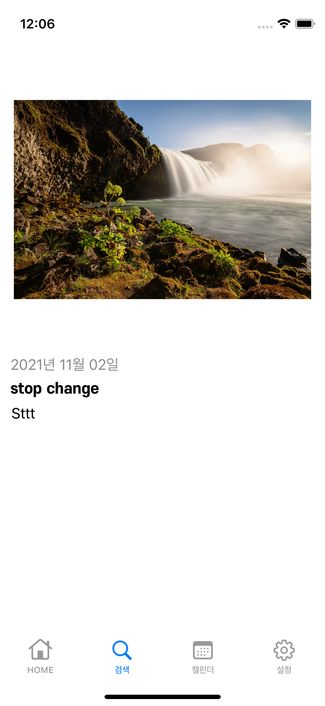

# SeSAC 일기앱

[README_v1](README_v1.md)

# 추가 기능
1. AddViewController에서 카메라, 이미지 선택 추가 가능(이미지의 경우 PHPicker 이지만 아직, 사용자가 선택한 이미지에만 접근하는 기능은 구현안됨)
2. SearchViewController 테이블에서 셀 왼쪽에서 Swipe시 편집 기능 구현, AddViewController로 이동, 편집모드로 동작함
3. 셀을 그냥 눌렀을 때는 디테일 뷰로 이동함, 디테일 뷰에서는 NavigationPopGesture로 빠져나올 수 있음

|1|2|3|
|-|-|-|
|||


# 1. 
- ImageView를 눌렀을 때 카메라를 이용할 것인지, 앨범을 이용할 것인지 액션 시트로 출력
```Swift
 func photoMenu() {
    let alert = UIAlertController(title: nil, message: nil, preferredStyle: .actionSheet)
    let cancel = UIAlertAction(title: LocalizableStrings.cancel.localized, style: .cancel, handler: nil)
    alert.addAction(cancel)
    
    let takePhoto = UIAlertAction(
      title: LocalizableStrings.camera.localized, style: .default) { [weak self] _ in
        guard let self = self else { return }
        DispatchQueue.main.async {
          self.showCameraView()
        }
      }
    alert.addAction(takePhoto)
    
    let choosePhotoFromLibrary = UIAlertAction(
      title: LocalizableStrings.album.localized, style: .default) { [weak self] _ in
        guard let self = self else { return }
        DispatchQueue.main.async {
          self.showPhotoLibrary()
        }
      }
    alert.addAction(choosePhotoFromLibrary)
    
    present(alert, animated: true)
  }
```
- Camera 인 경우는 ImagePicker로, 앨범 선택시는 PHPicker로 동작함


# 2. 
- SearchViewController에서 왼쪽에서 Swipe시 편집 가능
```Swift
  func tableView(_ tableView: UITableView, leadingSwipeActionsConfigurationForRowAt indexPath: IndexPath) -> UISwipeActionsConfiguration? {
    let edit = UIContextualAction(style: .normal, title: LocalizableStrings.edit.localized) { [weak self] (_, _, success: @escaping (Bool) -> Void) in
      guard let self = self else { return }
      guard let controller = UIStoryboard(name: "Content", bundle: nil)
        .instantiateViewController(withIdentifier: AddViewController.identifier)
              as? AddViewController else { print("AddViewController load failure"); return }
      
      controller.editDiary = self.tasks[indexPath.row]
      controller.isEditingMode = true
      controller.modalPresentationStyle = .fullScreen
      self.present(controller, animated: true)
      
      success(true)
    }
    edit.backgroundColor = .systemTeal
    return .init(actions: [edit])
  }
```
- UIContextualAction 자체를 처음 써봄, 이해하고 쓴건 아니고 코드 복붙했음, 선택시 AddViewController로 이동하는데 이때 에디트모드와, 편집용 인스턴스를 전달함

- AddViewController에서는 편집모드 일시 전달된 인스턴스로 UI를 업데이트 함
```Swift
//편집모드 Boolean이 true일때 호출
func editModeConfigure() {
    if let diary = editDiary {
      titleTextField.text = diary.title
      dateLabel.text = diary.writeDate.dateString
      diaryDescriptionTextView.text = diary.content
      
      let url = imageFileURL(fileName: "\(diary._id)")
      do {
        let data = try Data(contentsOf: url)
        let image = UIImage(data: data)
        titleImageView.image = image
      } catch let error {
        alertFunction(self, title: LocalizableStrings.alert.localized, body: error.localizedDescription)
      }
    }
  }
```

- 저장시에도 editMode인지 아닌지 구분하여 코드를 분기함
```Swift
if isEditingMode, let diary = editDiary {
      let taskToUpdate = UserDiary(
        title: titleTextField.text!,
        content: diaryDescriptionTextView.text,
        writeDate: dateLabel.text!.dateType!,
        registrationDate: diary.registrationDate)
      
        try! localRealm.write {
          localRealm.create(UserDiary.self,
                            value: ["_id": diary._id,
                                    "title": taskToUpdate.title,
                                    "content": taskToUpdate.content ?? "",
                                    "writeDate": taskToUpdate.writeDate],
                            update: .modified)
          saveImage(imageName: "\(diary._id)", image: titleImageView.image!)
          let hudView = HudView.hud(inView: view, animated: true)
          hudView.text = LocalizableStrings.saveDiary.localized
          
          afterDelay(0.5) {
            hudView.hide()

            self.dismiss(animated: true, completion: nil)
          }
        }
      
    } else ...
  ```
   

# 3. 
- DetailView에서는 특별한 코드는 없고 Diary 인스턴스를 전달받아 화면에 보여줌, 편집등은 일체 불가능한 순전히 보기용 뷰, Swipe gesture로 pop할 수 있다.

```Swift
  func navigationSetup() {
    navigationController?.navigationBar.isHidden = true
    navigationController?.interactivePopGestureRecognizer?.delegate = self
    navigationController?.interactivePopGestureRecognizer?.isEnabled = true
  }
```

|Add|Detail|Edit|
|-|-|-|
||||

# ...
- 오히려 네비게이션 팝제스쳐 때문에 시간 많이 잡아 먹은듯, 테이블 뷰 컨트롤러에서만 기본적으로 제공하는 걸 처음 알았다.
- HudView 연습해 봤다. 아직 헷갈린다.
- 디테일 뷰를 좀더 이쁘게 해주고 싶은데 디자인을 못하겠다.