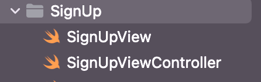

# 회원가입 구현하기
## MVVM 이해하기
[Notion](https://gookbobhenry.notion.site/MVVM-eb74da5ceb494f3c801bf96b98157382)



수업에서 배운 대로 MVVM 이용해서 작성함
MVVM에서는 ViewController가 없어서 둘다 뷰에 해당 되는거 같은데, View는 UI배치들이 있고, ViewController에는 주로 타겟 연결 등이 이루어 졌다. 


```Swift
  @objc func sendSignUpRequest() {
    mainView.signUpButton.configuration?.showsActivityIndicator = true
    mainView.signUpButton.isEnabled = false
    viewModel.postSignUpRequest { user, error in
      DispatchQueue.main.async {
        if let _ = user {
          guard let windowScene = UIApplication.shared.connectedScenes.first as? UIWindowScene else { return }
          windowScene.windows.first?.rootViewController = MainViewController()
          windowScene.windows.first?.makeKeyAndVisible()
        }
        
        if let error = error {
          let alert = UIAlertController(title: "회원가입 실패", message: error.localizedDescription, preferredStyle: .alert)
          alert.addAction(.init(title: "확인", style: .default))
          self.present(alert, animated: true)
        }
        self.mainView.signUpButton.configuration?.showsActivityIndicator = false
        self.mainView.signUpButton.isEnabled = true
      }
    }
  }
```
- View에서는 ViewModel에서 전달받은 결과되로 View를 업데이트만 하면 되는 상황, 에러가 전달됐을때는 에러 컨트롤러를 출력한다.


## APIService
```Swift
    let json = ["username": username,
                "email": email,
                "password": password]
    let data = try? JSONSerialization.data(withJSONObject: json)
    request.httpBody = data
```
- API요구사항에 body는 =과 &로 이루어져 있는데 위 방법은 json 그대로 들어간다. 다르게 해야했을 듯


