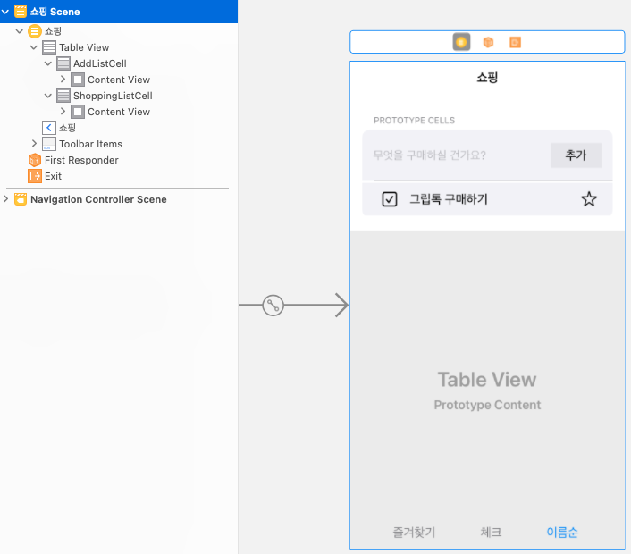
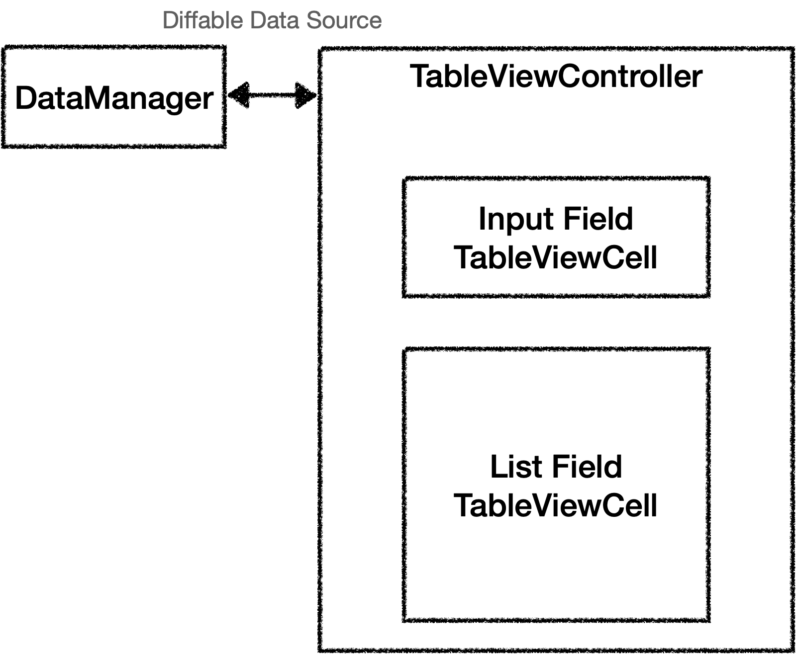

# Shopping List
## UI구성

|스토리보드|실행화면|
|:-:|:-:|
|||

- 단일 뷰로 테이블 뷰는 입력 섹션과 리스트 셀로 구분 됨

## !! DiffableDataSource에 문제가 생겨서 DataSource로 돌아옴

## 테이블 뷰 구성

- 테이블 뷰의 셀은 Diffable Data Source로 적용
- Input Field와 ListField 액션 동작은 Delegate로 전달

### ListField Cell

```Swift
import UIKit

protocol ShoppingListCellDelegate: AnyObject {
  func shoppingListCell(_ shoppingListCell: ShoppingListCell, tappedCheckbox check: Bool, index: Int)
  func shoppingListCell(_ shoppingListCell: ShoppingListCell, tappedStar check: Bool, index: Int)
}

class ShoppingListCell: UITableViewCell {
  @IBOutlet weak var backscreenView: UIView! {
    didSet {
      backscreenView.layer.cornerRadius = 15
    }
  }
  @IBOutlet weak var checkboxImageView: UIImageView! {
    didSet {
      checkboxImageView.isUserInteractionEnabled = true
      let tap = UITapGestureRecognizer(target: self, action: #selector(toggleCheckBox(sender:)))
      checkboxImageView.addGestureRecognizer(tap)
    }
  }
  @IBOutlet weak var itemNameLabel: UILabel!
  @IBOutlet weak var markImageView: UIImageView! {
    didSet {
      markImageView.isUserInteractionEnabled = true
      let tap = UITapGestureRecognizer(target: self, action: #selector(toggleStar(sender:)))
      markImageView.addGestureRecognizer(tap)
    }
  }
  
  var check: Bool = false
  var star: Bool = false
  var idx: Int = 0
  
  weak var delegate: ShoppingListCellDelegate?
  
  func configuration(_ idx: Int?, for wish: Wish) {
    check = wish.check
    star = wish.star
    guard let idx = idx else { return }
    self.idx = idx
    checkboxImageView.image = wish.check ? UIImage(systemName: "checkmark.square.fill") : UIImage(systemName: "checkmark.square")
    itemNameLabel.text = wish.wishDescription
    markImageView.image = wish.star ? UIImage(systemName: "star.fill") : UIImage(systemName: "star")
  }
  
  
  @objc func toggleCheckBox(sender: UITapGestureRecognizer) {
    delegate?.shoppingListCell(self, tappedCheckbox: check, index: idx)
  }
  
  @objc func toggleStar(sender: UITapGestureRecognizer) {
    delegate?.shoppingListCell(self, tappedStar: star, index: idx)
  }
}
```
- TableViewCell 은 viewDidLoad가 없어서 제스처나 초기화를 어디서 해야 하나 했는데 저번에 SeSAC 과정 누군가가 올려준 방법으로 할 수 있었다.
- 인터넷에서 찾아보다가 나온 방법인데 커스텀 셀인 경우 TableViewController에서 Cell에 일일이 데이터를 전달하는 것보다는 CustomCell Class 안에서 모델을 통째로 전달받아 클래스 안에서 작업하는 것이 훨씬 코드가 정리가 된 것 같다.


### Model, Manager
```Swift
struct Wish: Codable, Equatable, Hashable {
  let wishDescription: String
  var check: Bool = false
  var star: Bool = false
}
```
- 모델은 저장,로드, 정렬, DiffableDataSource에서 쓰기위한 프로토콜 채용

```Swift
import Foundation

class ShoppingList {
  static let shared = ShoppingList()
  private init() {}
  var wishList: [Wish] = []
  
  private let initData = [
    Wish(wishDescription: "그립톡 구매하기", check: true, star: true),
    Wish(wishDescription: "사이다 구매", star: false),
    Wish(wishDescription: "아이패드 케이스 최저가 알아보기", star: true),
    Wish(wishDescription: "양말", star: true),
  ]
  
  private let wishsJSONURL = URL(fileURLWithPath: "Wishs", relativeTo: FileManager.documentDirectoryURL).appendingPathExtension("json")
  
  func saveWishs() {
    let encoder = JSONEncoder()
    encoder.outputFormatting = .prettyPrinted
    do {
      let wishsData = try encoder.encode(wishList)
      try wishsData.write(to: wishsJSONURL, options: .atomic)
    } catch let error {
      print(error.localizedDescription)
    }
  }
  
  func loadWishis() {
    let decoder = JSONDecoder()
    guard let wishData = try? Data(contentsOf: wishsJSONURL) else {
      wishList = initData
      return
    }
    do {
      let wishs = try decoder.decode([Wish].self, from: wishData)
      wishList = wishs
      if wishList.isEmpty {
        wishList = initData
      }
    } catch let error {
      wishList = initData
      print(error)
    }
  }
  
  func addNewWish(wish: Wish) {
    wishList.append(wish)
    saveWishs()
  }
  
  func deleteWish(wish: Wish) -> Bool {
    guard let index = wishList.firstIndex(of: wish) else { return false }
    wishList.remove(at: index)
    saveWishs()
    return true
  }
}

extension FileManager {
  static var documentDirectoryURL: URL {
    self.default.urls(for: .documentDirectory, in: .userDomainMask)[0]
  }
}
```
- UserDefaults 말고 FileManager를 통해 JSON으로 데이터를 저장해 보았다. 근데 둘 차이점이 별로 없는 것 같다. 커스텀 모델을 저장할 때는 둘다 똑같은 수준으로 수고로운 것 같다. CoreData빨리 익혀야지

## Table View Controller 전체코드
[전체코드](ShoppingList/Controller/ShoppingListViewController.swift)

## ...
DiffableDataSource 처음 적용해본 어플리케이션, 아직 헷갈리기는 한데 한 두번만 더 사용해보면 다 외울 것 같다.

- 셀의 체크 표시와 즐겨찾기 버튼을 `configureDataSource`에서 커스텀 셀에서 델리게이트로 사용하기 위해 row에 대한 정보를 indexPath로 넘겨줬는데 이게 데이터 모델의 인덱스와 실제 뷰의 인덱스가 일치하지 않게 되는 DiffableDataSource 목적이랑 다소 벗어난 결과가 나왔다.
결국 정렬을 할때마다 모델에 정렬된 데이터로 새로 갱신 해주긴 했는데, 이럴꺼면 왜썼나 싶기도 하고, 다른 방법을 찾아봐야 할 것 같다.

- 테이블 셀을 삭제할 때 원래 Data Source에서는 `tableView.deleteRow`를 사용해서 지웠는데, DiffableDataSource에서는 apply가 애니메이션 효과를 겸 하기 때문에 충돌하는지 에러가 발생했다. 당연히 deleteRow는 필요없으니까 삭제로 해결

- 즐겨찾기 버튼과, 체크 버튼 누르고 업데이트 할때 애니메이션 효과를 주니까 정렬 하는 부분이랑 충돌이 생겨서 UI가 엉켰다. 애초에 애니메이션을 잘못 준거긴 한데 당황했다. update메소드에 animatingDifferences 값을 같이 전달해 주기를 잘했다.

## 현재 문제
- ~~똑같은 이름으로 쇼핑 리스트 생성하면 앱이 크래시, 앱이 다시는 안켜짐 ㅋ~~ uuid 로 해결
- 셀 삭제후 바로 체크리스트나, 즐겨찾기 누르면 UI엉킴 (DataSource로 돌아옴..ㅠㅜ)
- ~~키보드 리자인이 불편함, 키보드 악새서리나 다른 곳 누르면 리자인 되도록 수정해야할 것 같음.~~ (뷰 누르면 키보드 리자인 되도록 해결)

## DiffableDataSource
- 똑같은 이름으로 셀 생성시 충돌을 방지하기 위해 UUID().uuidString을 모델에 추가했는데 아무래도 그게 DiffableDataSource addList의 mockup으로 사용될 때 아이디가 자꾸 바뀌니까 갱신하는 줄 알고 apply할 때마다 계속 갱신해버리는거 같다 (애니메이션 필요없는데 계속 발생)
- 체크 버튼, 즐겨찾기 버튼 , 정렬 엉키는거 계속 시도해봤는데 답이 없다. 다른 괜찮은 예제나 디자인 패턴을 찾아보고 배워야 할 것 같다. 결과적으로 DataSource로 돌아옴