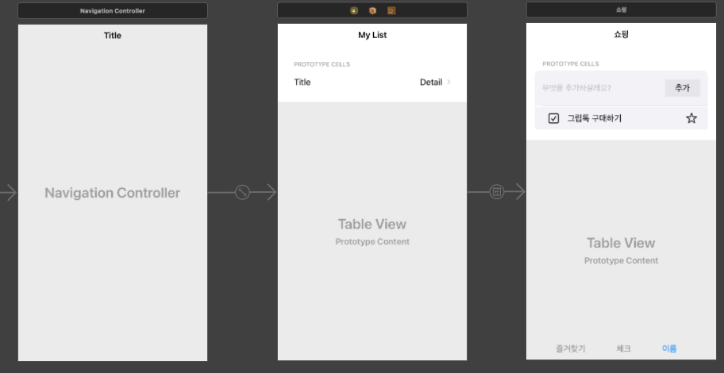

# Shopping List 

## 카테고리 구현
- Category라는 이름의 상위 클래스를 만들고, Category안에서 UserWish를 리스트로 가짐
```Swift
class UserWish: Object {
  @Persisted(primaryKey: true) var _id: ObjectId
  @Persisted var wishDescription: String
  @Persisted var check: Bool
  @Persisted var star: Bool
  
  convenience init(wishDescription: String) {
    self.init()
    
    self.wishDescription = wishDescription
    self.check = false
    self.star = false
  }
}

class Category: Object {
  @Persisted(primaryKey: true) var _id: ObjectId
  @Persisted var category: String
  @Persisted var wishList: List<UserWish>
  
  convenience init(category: String) {
    self.init()
    self.category = category
  }
}
```


- 카테고리 뷰가 상위에 있고, 카테고리를 생성, 디테일로 들어가면 각 카테고리에 UserWish를 추가할 수 있음
- 특별히 볼만한 코드는 없음!
- 카테고리를 삭제할 때 처음에는 `localRealm.delete(category)`만 해줬는데 `List<WishList>`는 삭제가 안되더라, 몇번 해보다가 문제점을 찾으려고 노력했는데, 딱히 그런거는 아니었고 상위 인스턴스를 삭제하기 전에 내부 리스트도 삭제를 해주면 되긴 되더라, 문서 보고는 있는데 맞는 방법인지는 모르겠음

```Swift
override func tableView(_ tableView: UITableView, commit editingStyle: UITableViewCell.EditingStyle, forRowAt indexPath: IndexPath) {
    let category = categories[indexPath.row]
    try! localRealm.write {
      localRealm.delete(category.wishList)
      localRealm.delete(category)
      tableView.deleteRows(at: [indexPath], with: .automatic)
    }
  }
```

|1|2|
|-|-|
||