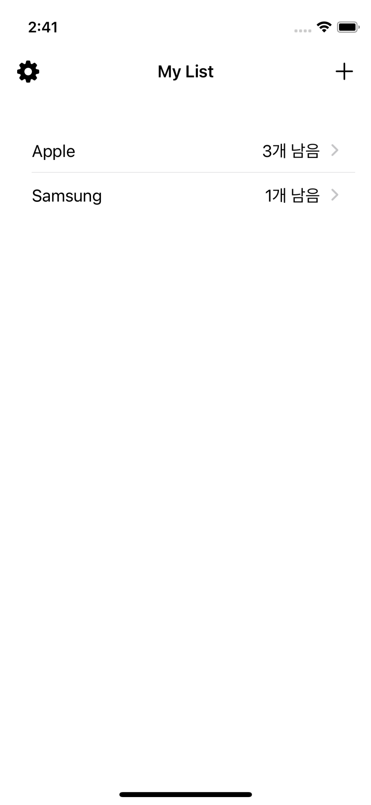
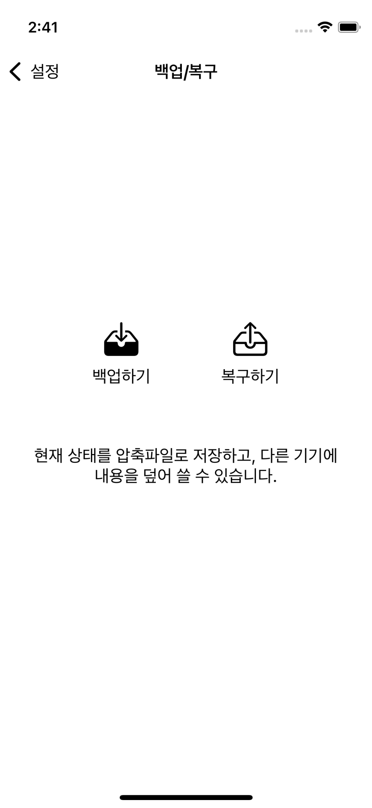
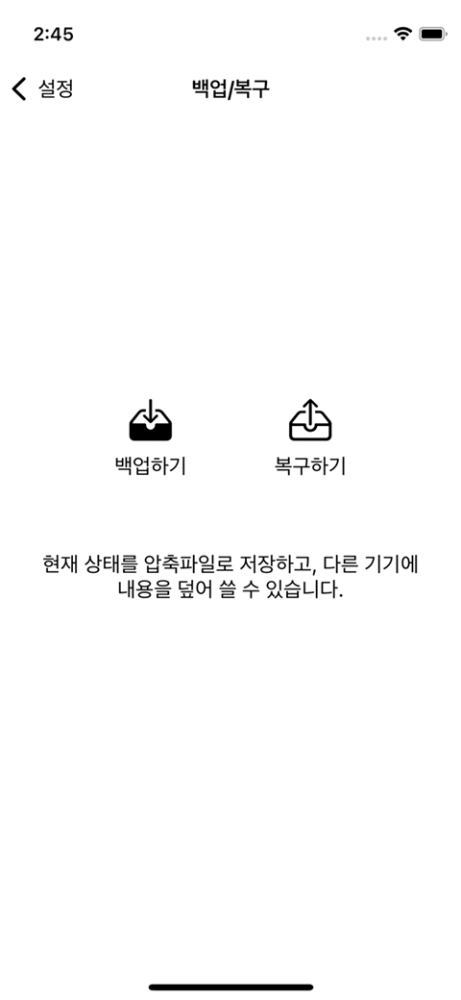
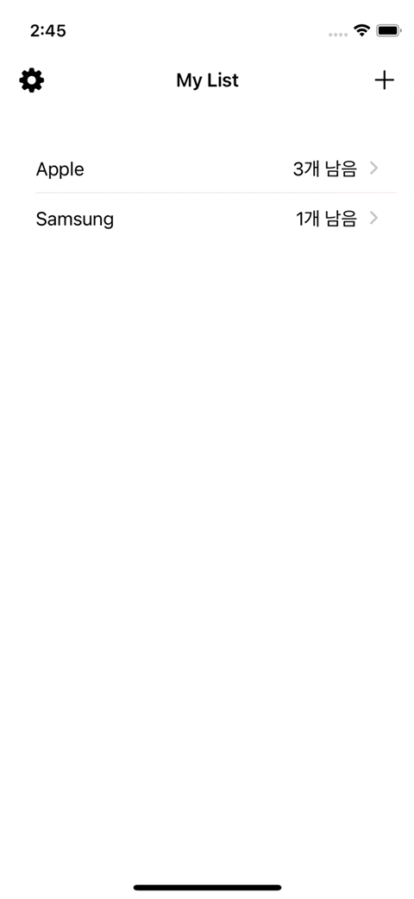

# Shopping List 

- [README.md](README_v1.md)
- [README.md](README_v2.md)
- [README.md](README_v3.md)


# 추가 구현 기능
- 백업/복구 UI
- 백업/복구 기능

|1|2|3|
|-|-|-|
|||

## backup aciton
```Swift
  @IBAction func backupData() {
    showAlert(self, title: "데이터 백업", body: "데이터를 압축 파일로 백업합니다. \n해당 파일을 안전하게 저장한 뒤, 복구할 때 불러올 수 있습니다. \n파일이 손상되지 않도록 유의해야 합니다.") { [weak self] _ in
      guard let self = self else { return }
      
      let realm = URL(fileURLWithPath: "default.realm", relativeTo: getDocumnetDirectoryPath())

      if FileManager.default.fileExists(atPath: realm.path) {
        do {
          Zip.addCustomFileExtension("myList")
          print(self.archivePath)
          try Zip.zipFiles(paths: [realm], zipFilePath: self.archivePath, password: "1234") { progress in
            print(progress)
            //HUD View
          }
          self.showActivityViewController()
        } catch let error {
          showAlert(self, title: "알림", body: error.localizedDescription, onlyOk: true)
        }
      } else {
        showAlert(self, title: "알림", body: "백업할 파일이 존재하지 않습니다")
      }
    }
  }
```
- progress 나타낼 hudview는 아직 구현 안함
- 해당 Zip 라이브러리에 있는 패스워드 입력은 아스키로 변환되는거 같은데 디바이스에서는 암호를 알아도 직접 언패킹은 안된다

```Swift
  func showActivityViewController() {
    let activity = UIActivityViewController(activityItems: [archivePath], applicationActivities: [])
  
    activity.completionWithItemsHandler = { (activityType: UIActivity.ActivityType?, completed: Bool, returendItems: [Any]?, error: Error?) in
      if completed {
        try? FileManager.default.removeItem(at: self.archivePath)
        showAlert(self, title: "완료", body: "", onlyOk: true)
      }
    }
    present(activity, animated: true)
  }
```
- activity에서 저장이 끝나면 컴플리션 핸들러로 Sandbox Documents에 있는 archive.zip을 지운다.


## Restore Action
```Swift
  @IBAction func restoreData() {
    showAlert(self, title: "데이터 복구", body: "백업된 데이터를 불러옵니다. \n 기존 데이터에 덮어쓰는 작업으로 이전 데이터는 삭제됩니다!") { [weak self] _ in
      guard let self = self else { return }
      let documnetPicker = UIDocumentPickerViewController(forOpeningContentTypes: [.archive, .zip], asCopy: true)
//      let documnetPicker = UIDocumentPickerViewController(documentTypes: [kUTTypeArchive as String], in: .import)
      documnetPicker.delegate = self
      documnetPicker.allowsMultipleSelection = false
      
      self.present(documnetPicker, animated: true)
    }
  }
```
- `UIDocumentPickerViewController(documentTypes:)가 14.0 deprecated라서`라서 `UIDocumentPickerViewController(forOpeningContentTypes:)`를 썼다.
- 근데 여기서 아마도 문제 대폭발

```Swift
extension DataManagerViewController: UIDocumentPickerDelegate {
  func documentPicker(_ controller: UIDocumentPickerViewController, didPickDocumentsAt urls: [URL]) {
    guard let selectedUrl = urls.first else { return }
    
    do {
//      guard archivePath.startAccessingSecurityScopedResource() else {
//        showAlert(self, title: "실패", body: "앱의 디렉토리 접근에 실패했습니다.", onlyOk: true, handler: nil)
//        return
//      }
//      let data = try Data(contentsOf: selectedUrl)
//      try data.write(to: archivePath, options: .atomic)
      
      try FileManager.default.copyItem(at: selectedUrl, to: archivePath)
      try Zip.unzipFile(archivePath, destination: getDocumnetDirectoryPath(), overwrite: true, password: "1234", progress: { progress in
        print(progress)
        //progress hud view
      }, fileOutputHandler: { unzippedFile in
        showAlert(self, title: "알림", body: "백업 파일을 불러왔습니다\n 잠시 후 어플리케이션이 강제로 종료됩니다.", onlyOk: true)
        self.view.isUserInteractionEnabled = false
      })
      try FileManager.default.removeItem(at: archivePath)
      //countdown hud view
      afterDelay(3) {
        exit(0)
      }
    } catch let error {
      showAlert(self, title: "알림", body: error.localizedDescription, onlyOk: true)
    }
    archivePath.stopAccessingSecurityScopedResource()
  }
}
```
- 시뮬레이션에서는 괜찮은데 디바이스에서는 백업된 archive.zip를 Document 디렉토리에 접근이 불가하다고 저장을 못했다.
- 각종 권한문제, 등등 다 살펴봤는데 해결이 안됐다.
- 근데 `UIDocumentPickerViewController(documentTypes:)로 다시 하니 해결이 됐고, 다시 `UIDocumentPickerViewController(forOpeningContentTypes:)`를 썼는데 그 문제가 해결이 됐다?
- 클린 빌드를 한번 더 해보고 실험해봐야 겠다. 오늘은 일단 그만.

|백업|복구|
|-|-|
|||