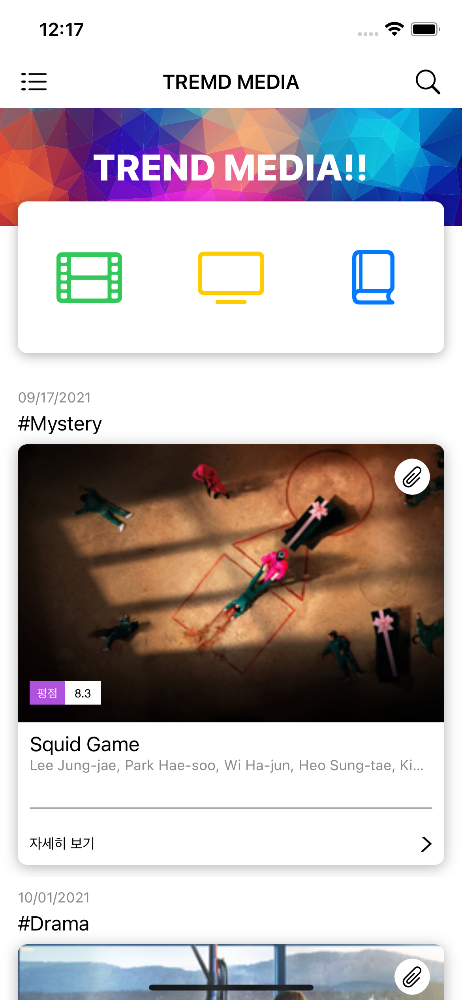
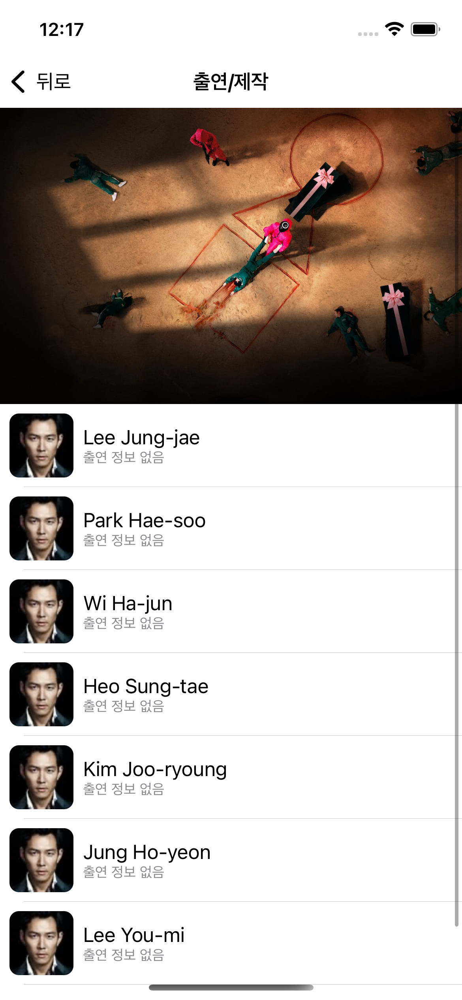
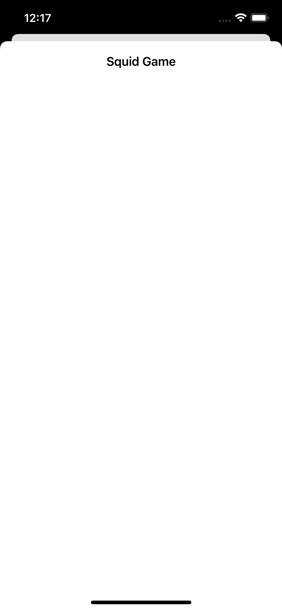

# Trend Media 1018

[1017 버전 README](1017README.md)

# UI 구성

|메인UI|Search|Detail|Popup|
|:-:|:-:|:-:|:-:|
||||

## 변경점
- main에서 클립 버튼 누르면 popup 뷰로 전환
```Swift
extension MainViewController: MediaTableViewCellDelegate {
  func mediaTableViewCell(_ mediaTableViewCell: MediaTableViewCell, mediaContent: MediaContent?) {
    guard let controller = storyboard?.instantiateViewController(withIdentifier: "\(WebViewController.self)")
            as? WebViewController else { return }
    controller.mediaContent = mediaContent
    controller.modalPresentationStyle = .formSheet
    present(controller, animated: true, completion: nil)
    
  }
}
```
- cell height를 화면 크기에 따라 동적으로 조절
```Swift
  func tableView(_ tableView: UITableView, heightForRowAt indexPath: IndexPath) -> CGFloat {
    indexPath.section == 0 ? 227 : view.frame.height / 2
  }
```

- kingfisher 기능 활용하여 이미지 로딩 UX향상, 이미지를 불러오는 동안 activity indicator표시, 전환 효과, 캐싱
```Swift
    let url = URL(string: media.backdropImage)
    let processor = DownsamplingImageProcessor(size: mediaPosterImage.bounds.size)
    mediaPosterImage.kf.indicatorType = .activity
    mediaPosterImage.kf.setImage(
      with: url,
      placeholder: UIImage(),
      options: [
        .processor(processor),
        .transition(.fade(1)),
        .cacheOriginalImage
      ]) { result in
        switch result {
        case .success(let value):
          print("Task don for: \(value.source.url?.absoluteString ?? "")")
        case .failure(let error):
          print("Job failed: \(error.localizedDescription)")
        }
      }
```

- DetailView Header 추가
- DetailView에서 헤더와 네비게이션 사이 gap 삭제
```Swift
    if #available(iOS 15.0, *) {
      tableView.sectionHeaderTopPadding = 0
    }
```

- NavigationBar Clear 상태 제거


# ...
- Kingfisher에 의존해서 당초 달성하려던 더 나은 이미지 로딩 경험을 만들었지만, 구체적으로 어떻게 공부하는지 라이브러리 자체를 공부하던, 원리를 공부하던 해야 할듯
- 처음에 DetailView의 헤더를 xib이 아니라 snapkit을 써서 코드로만 구현 해보았는데 이상하게 안됐음, 근데 다시 xib으로 구현하고 나니 어떤 부분이 다른지 깨달음, snapkit으로 할때는 수퍼뷰에 대해 이미지 뷰의 width, height 앵커만 박았는데, 컨테이너 뷰의 사이즈를 디바이스 크기에 맞춘다음 leading, trailing, top, bottom을 equalTo를 0으로 뒀어야 했을 것 같다. 왜냐하면 오토 레이아웃이 그렇게 잡혀있으니까