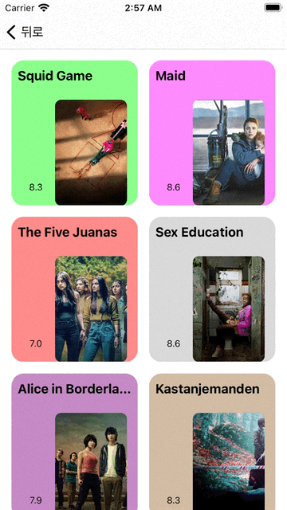

# Trend Media 1019

[1017 버전 README](1017README.md)<br>
[1018 버전 README](1018README.md)

# UI 구성

|Detail|Booklist|
|:-:|:-:|
|||

## 변경점
- DetailMediaView에서 버튼을 누르면 스토리라인이 확장되어 보이고, 축소시킬수도 있음
```Swift
  @objc func openStorylineView() {
    
    tableView.performBatchUpdates {
      self.pageScrollState.toggle()
      self.storylineViewHeight = self.pageScrollState ? UITableView.automaticDimension : closedStorylineHeight
    } completion: { [weak self] _ in
      self?.tableView.reloadData()
    }
  }


 let storyline = mediaContent.overview
      cell.storylineLabel.text = storyline
      let scrollButtonImage = pageScrollState
      ? UIImage(systemName: "chevron.up")
      : UIImage(systemName: "chevron.down")
      cell.pageScrollButton.setImage(scrollButtonImage, for: .normal)
      cell.pageScrollButton.addTarget(self, action: #selector(openStorylineView), for: .touchUpInside)
```

- BookListView 컬렉션 뷰로 추가됨


# ...
- 스토리라인을 확장하는 애니메이션을 처음에는 animate안에서 tableView.beginUpdates(), tableView.endUpdates()로 해보았는데 이것만 하면 데이터는 리로드가 되지 않았다. 쓸줄 모르는 건가 싶어서 찾아보던 더 최근에 나온게  `performBatchUpdates`라는데 completion에 reloadData를 넣었지만 버튼의 이미지가 바뀌는게 좀 늦다. 왤까.?
- 시간 꼭 내서 Animation 꼭좀 진짜 공부하고 싶다.
- Label이 축소 되었을 때 높이 위치랑 확장되었을 때 높이 위치가 달라진다. 해결을 못하겠다. 영문을 모르겠음
- 컬렉션 뷰의 각 셀에 들어오는 이미지 뷰에서 평균 색상을 검출해서 뒷배경 색을 결정하려고 했는데 인터넷에서 구한 코드가 너무 느리고 무겁더라. 지금 그 코드를 구현하려면 사전에 평균 컬러를 구해놓는 수 밖에는 없을 것 같다. 이미지를 로드하고 구하고 하기에는 셀의 수가 너무 많고 해당 알고리즘이 너무 느리다.
```Swift
//https://www.hackingwithswift.com/example-code/media/how-to-read-the-average-color-of-a-uiimage-using-ciareaaverage


extension UIImage {
    var averageColor: UIColor? {
        guard let inputImage = CIImage(image: self) else { return nil }
        let extentVector = CIVector(x: inputImage.extent.origin.x, y: inputImage.extent.origin.y, z: inputImage.extent.size.width, w: inputImage.extent.size.height)

        guard let filter = CIFilter(name: "CIAreaAverage", parameters: [kCIInputImageKey: inputImage, kCIInputExtentKey: extentVector]) else { return nil }
        guard let outputImage = filter.outputImage else { return nil }

        var bitmap = [UInt8](repeating: 0, count: 4)
        let context = CIContext(options: [.workingColorSpace: kCFNull])
        context.render(outputImage, toBitmap: &bitmap, rowBytes: 4, bounds: CGRect(x: 0, y: 0, width: 1, height: 1), format: .RGBA8, colorSpace: nil)

        return UIColor(red: CGFloat(bitmap[0]) / 255, green: CGFloat(bitmap[1]) / 255, blue: CGFloat(bitmap[2]) / 255, alpha: CGFloat(bitmap[3]) / 255)
    }
}
```