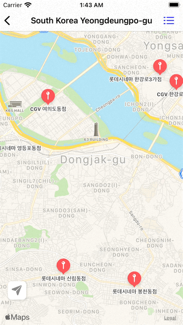

# Trend Media 1020

[1017 버전 README](1017README.md)<br>
[1018 버전 README](1018README.md)<br>
[1019 버전 README](1019README.md)<br>

# UI 구성

|ShowUserLocation|FilterTheather|Alert1|Alert2|
|:-:|:-:|:-:|:-:|
|||||

## 변경점
- 메인 화면에서 영화관 위치 정보를 얻기 위해 맵 뷰로 이동할 수 있다.
  - 당장 특별한 데이터 이동이 없기 때문에 세그로 바로 이동하도록 구현
- 현재 사용자 위치를 얻을 수 있다.

```Swift
let defaultLocation = CLLocationCoordinate2D(latitude: 37.566667, longitude: 126.978368)
  var userLocation: CLLocationCoordinate2D? {
    didSet {
      //annotation update
      if let userLocation = userLocation {
        mapView.removeAnnotation(userAnnotation)
        userAnnotation.coordinate = userLocation
        userAnnotation.title = "지금 위치"
        mapView.addAnnotation(userAnnotation)
      }
      
      
      //reverse geocoding
      if let userLocation = userLocation {
        geocoder.reverseGeocodeLocation(.init(latitude: userLocation.latitude, longitude: userLocation.longitude)) { placemarks, error in
          if error == nil, let places = placemarks, !places.isEmpty {
            self.placemark = places.last!
          } else {
            self.placemark = nil
          }
        }
        if let placemark = placemark {
          let address = "\(placemark.country?.description ?? "") \(placemark.locality?.description ?? "") \(placemark.subLocality?.description ?? "")"
          title = address
        }
      }
      
    }
  }

  
```

- 현재 위치 추적 버튼을 이용해서 현재 위치로 맵을 이동시킬 수 있다.

```Swift
  var locationTraceState = false {
    didSet {
      if locationTraceState {
        locationManager.startUpdatingLocation()
        userLocationButton.tintColor = .blue
      } else {
        locationManager.stopUpdatingLocation()
        userLocationButton.tintColor = .gray
      }
    }
  }
```

```Swift
extension MapViewController: MKMapViewDelegate {
  func mapViewDidChangeVisibleRegion(_ mapView: MKMapView) {
    locationTraceState = false
  }
}
```
- 맵을 이동시키면 현재 위치가 아닌 것으로 판단!

- 전국 영화관 위치 정보를 확인할 수 있다.
  - 멘토님이 몇개의 데이터를 주셨지만, 추후에 어노테이션 클러스터링도 해보고 싶기 때문에 더 많은 데이터를 찾았다. 겸사겸사 파싱, 번들, 파일매니저도 또 연습했다.
  - Xcode에서 추가한 리소스는 Bundle.main.url로 접근해야 하고 , 저장된 데이터를 불러오는 (혹은 그런것들을 해야 하는 곳) 곳은 FileManager.default.urls, documentDirectory와 UserDomaindisk! 헷갈리지 말자
  - 받은 파일은 CSV로 코드로 JSON으로 컨버팅 해두었다.
  ```Swift
  func load() throws {

    guard let url = Bundle.main.url(forResource: "cinemas", withExtension: "json") else { print("url failure"); return }
    let decoder = JSONDecoder()
    do {
      let data = try Data(contentsOf: url)
      theaters = try decoder.decode([TheaterLocation].self, from: data)
    } catch let error {
      print(error.localizedDescription)
    }
  }
  ```

- 영화관 필터링
  - 영화관 필터링을 어떻게 해야 하나 고민하다 그냥 매니저에 아래 코드를 추가
```Swift
var lotteTheaters: [TheaterLocation] {
    theaters.filter { theater in
      theater.brand == "롯데시네마"
    }
  }
  
  var megaboxTheaters: [TheaterLocation] {
    theaters.filter { theater in
      theater.brand == "메가박스"
    }
  }
  
  var cgvTheaters: [TheaterLocation] {
    theaters.filter { theater in
      theater.brand == "CGV"
    }
  }
```  

  - 컨트롤러에서는 다음과 같이 썼다.
```Swift
@IBAction func filterCinemaPlace(_ sender: UIBarButtonItem) {
    let actionAlert = UIAlertController(title: nil, message: nil, preferredStyle: .actionSheet)
    let megabox = UIAlertAction(title: "메가박스", style: .default) { _ in
      self.locationManager.stopUpdatingLocation()
      
      self.mapView.removeAnnotations(self.theatersAnnotations)
      self.theatersAnnotations.removeAll()
      let megaboxes = self.manager.megaboxTheaters
      megaboxes.forEach { theater in
        let annotation = MKPointAnnotation()
        annotation.coordinate = CLLocationCoordinate2D(latitude: theater.latitude, longitude: theater.longitude)
        annotation.title = "\(theater.brand) \(theater.dong)점"
        self.theatersAnnotations.append(annotation)
      }
      self.mapView.addAnnotations(self.theatersAnnotations)
    }
    
    let lotte = UIAlertAction(title: "롯데시네마", style: .default) { _ in
      self.locationManager.stopUpdatingLocation()
      
      self.mapView.removeAnnotations(self.theatersAnnotations)
      self.theatersAnnotations.removeAll()
      let lottes = self.manager.lotteTheaters
      lottes.forEach { theater in
        let annotation = MKPointAnnotation()
        annotation.coordinate = CLLocationCoordinate2D(latitude: theater.latitude, longitude: theater.longitude)
        annotation.title = "\(theater.brand) \(theater.dong)점"
        self.theatersAnnotations.append(annotation)
      }
      self.mapView.addAnnotations(self.theatersAnnotations)
    }
    
    let cgv = UIAlertAction(title: "CGV", style: .default) { _ in
      self.locationManager.stopUpdatingLocation()
      
      self.mapView.removeAnnotations(self.theatersAnnotations)
      self.theatersAnnotations.removeAll()
      let cgvs = self.manager.cgvTheaters
      cgvs.forEach { theater in
        let annotation = MKPointAnnotation()
        annotation.coordinate = CLLocationCoordinate2D(latitude: theater.latitude, longitude: theater.longitude)
        annotation.title = "\(theater.brand) \(theater.dong)점"
        self.theatersAnnotations.append(annotation)
      }
      self.mapView.addAnnotations(self.theatersAnnotations)
    }
    
    let filterFree = UIAlertAction(title: "전체보기", style: .default) { _ in
      self.locationManager.stopUpdatingLocation()
      
      self.mapView.removeAnnotations(self.theatersAnnotations)
      self.theatersAnnotations.removeAll()
      self.showWholeTheatersAnnotations()
    }
    
    let cancel = UIAlertAction(title: "취소", style: .cancel)
    
    [megabox, lotte, cgv, filterFree, cancel].forEach { action in
      actionAlert.addAction(action)
    }
    
    present(actionAlert, animated: true, completion: nil)
    
  }
```
- 코드 중복이 많은데 다 액션의 컴플리션 헨들러 안에서 구현한거라, 취소 버튼을 고려했을 때 어떻게 리펙토링 해야할지 모르곘다. 지금 머리가 안돌아 가는 걸지도


- 위치정보 사용 불가시 설정창으로 이동할 수 있다.

```Swift
  func showRequestLocationServiceAlert() {
    let requestLocationServiceAlert = UIAlertController(title: "위치정보 이용", message: "위치 서비스를 사용할 수 없습니다. 기기의 '설정>개인정보 보호'에서 위치 서비스를 켜주세요.", preferredStyle: .alert)
    let goSetup = UIAlertAction(title: "설정으로 이동", style: .destructive) { _ in
      if let appSettings = URL(string: UIApplication.openSettingsURLString) {
        UIApplication.shared.open(appSettings, options: [:], completionHandler: nil)
      }
    }
    let cancel = UIAlertAction(title: "취소", style: .default)
    requestLocationServiceAlert.addAction(cancel)
    requestLocationServiceAlert.addAction(goSetup)
    
    present(requestLocationServiceAlert, animated: true, completion: nil)
  }
```
위 메소드를 통해 설정창으로 이동한다.


# ...
- 맵킷, 코어로케이션으로 개인 프로젝트도 했지만 여전히 헷갈린다. 10개 정도 만들면 안헷갈릴듯.
- 아직 어떻게 짜야지 효율적이고 구성 좋게 되는지 모르겠다.. 코드 전체를 하나부터 열까지 짤 수 있을 때 까지 연습해야 들어올듯.
- 마커는 영화관 마다 핀을 커스텀 하고, 클러스터링 하고 싶다.
