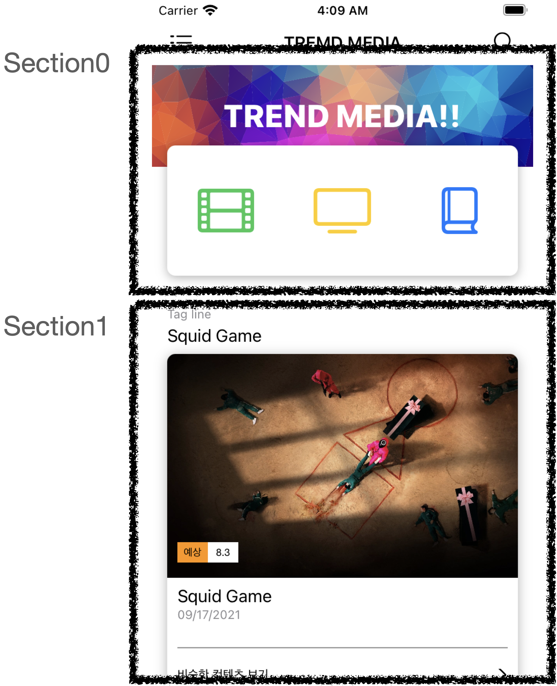
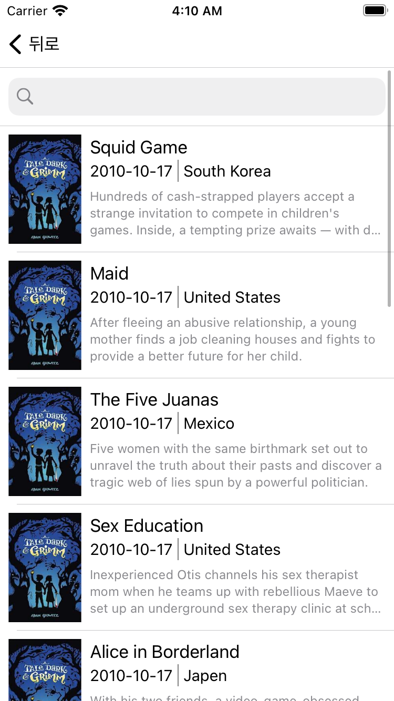
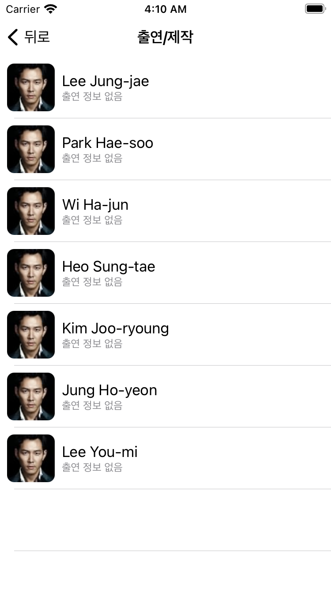
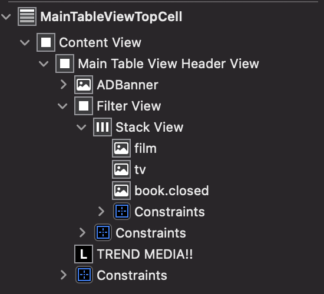
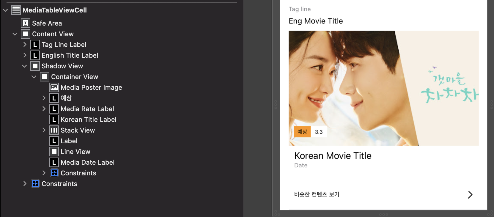
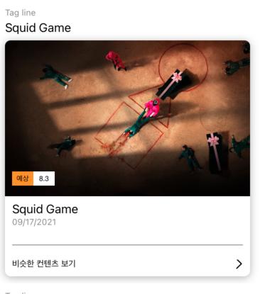

# Trend Media

# UI구성
|메인UI|B|C|
|:-:|:-:|:-:|
||||

## 메인 UI Section0
|내용|설명|
|-|-|
||View의 라운딩 코너와 그림자를 주기 위해 하위뷰들을 Filter View로 감쌌다.|
```Swift 
import UIKit
class MainTableViewTopCell: UITableViewCell {
  
  @IBOutlet weak var filterView: UIView! {
    didSet {
      filterView.layer.cornerRadius = 8
      filterView.layer.shadowOffset = .init(width: 0, height: 2)
      filterView.layer.shadowOpacity = 0.3
      filterView.layer.shadowRadius = 5
    }
  }
}
```

## 메인 UI Section1
|Documents|View|
|:-:|:-:|
|||
- Section1의 셀도 라운딩 효과와 그림자 효과가 같이 있으므로 컨테이너 뷰를 씌워 위에다가 그림자 효과를 주었다.
- 좀더 자세히 사용하기 위해 CALayer 학습함 (git 작성 중)
- image load는 우선 심플하게 하기 위해 `Kingfisher` 라이브러리 사용

- 라운딩, 그림자 코드
```Swift
  @IBOutlet weak var shadowView: UIView! {
    didSet {
      shadowView.clipsToBounds = false
      shadowView.backgroundColor = .clear
      shadowView.layer.shadowOpacity = 0.3
      shadowView.layer.shadowOffset = .init(width: 0, height: 2)
      shadowView.layer.shadowRadius = 6
    }
  }
  @IBOutlet weak var containerView: UIView! {
    didSet {
      containerView.layer.cornerRadius = 8
      containerView.clipsToBounds = true
      
    }
  }
```
- 비슷한 컨텐츠 보기 위에 라인은 라인만 표시해 주는 뷰를 따로 작성함
```Swift
import UIKit

class LineView: UIView {
  
  override func draw(_ rect: CGRect) {
    guard let context = UIGraphicsGetCurrentContext() else { return }
    
    let midY = bounds.midY
    let minX = bounds.minX
    let maxX = bounds.maxX
    
    context.setStrokeColor(UIColor.gray.cgColor)
    context.setLineWidth(1)
    context.move(to: CGPoint(x: minX, y: midY))
    context.addLine(to: CGPoint(x: maxX, y: midY))
    context.strokePath()
  }
}
```


## 개선했으면 하는 사항
- 이미지를 모델에서 바로 URL로 받아 Kingfisher로 로드하는데 느려서 셀이 바로 올바르게 표시되지 않음, 이미지가 로드 되지 않느 경우는 이미지만 안보여 줄게 아니라 셀 전체를 Activity View 같은걸로 대체해서 표시해주면 좋을 것 같음 로딩이 완료될 때 까지

## 짚고넘어갈 점
- 처음에 Section0을 테이블 뷰 셀이 아닌 그냥 뷰로 구현했다가 나중에 알고보니 같이 스크롤 되야 하더라, 그래서 하 헤더로 넣어버리면 되겠구나 해서 헤더로 넣었는데 생각해보니 헤더는 아니었다. 시간 낭비 많이함.. Section이 가장 늦게 떠오른게 참..


# Main View -> Detail View
메인 뷰 에서 디테일 뷰로 데이터 전달할 때 한번도 사용해보지 않은 방법으로 데이터를 전달해봄

DetailView
```Swift
  let mediaContent: MediaContent!

  required init?(coder: NSCoder) { fatalError("never be called") }

  init?(coder: NSCoder, mediaContent: MediaContent) {
    self.mediaContent = mediaContent
    super.init(coder: coder)
  }
```
표시할 미디어 컨텐츠가 옵셔널로 전달하거나 하지 않고 반드시 받아야 한다고 명시( 이 경우 생성자가 필요한데 ViewController 생성자를 한번도 안써봤다.)
그리고 Main View에서는 TableViewDelegate의 didSelectRowAt으로 아래와 같이 작성함
```Swift
let controller = storyboard?.instantiateViewController(identifier: "\(DetailMediaViewController.self)") { coder -> DetailMediaViewController? in
        DetailMediaViewController(coder: coder, mediaContent: self.mediaList[indexPath.row])
      }
```

- 네비게이션 바를 투명하게 만드는게 매번 헷갈리기 때문에 코드 적어둠
```Swift
    navigationController?.navigationBar.setBackgroundImage(UIImage(), for: .default)
    navigationController?.navigationBar.shadowImage = UIImage()
    navigationController?.navigationBar.backgroundColor = .clear
```

- DetailView의 경우 미디어의 정보를 받은 뒤 출연 정보 목록이 하나도 없다면 경고창 출력, 화면을 pop해서 뒤로 돌아감
```Swift
    //alert
    if mediaContent.cast.isEmpty {
      let alert = UIAlertController(title: "알림", message: "출연정보가 없습니다.", preferredStyle: .alert)
      let ok = UIAlertAction(title: "확인", style: .default) { _ in
        self.navigationController?.popViewController(animated: true)
      }
      alert.addAction(ok)
      present(alert, animated: true, completion: nil)
    }
```

## SearchViewController
- 해당 뷰에서는 날짜 정보를 `yyyy-MM-dd` 방식으로 표시해야 하는데 Data의 날짜 포멧이 다르므로 이를 변경하는 코드를 작성함
```Swift
 var mediaDate: String = ""
  
  private var releaseDate: String? {
    let formatter = DateFormatter()
    formatter.dateFormat = "MM/dd/yyyy"
    
    let printOutDateFormatter = DateFormatter()
    formatter.dateFormat = "yyyy-MM-dd"
    
    guard let date = formatter.date(from: mediaDate) else { return nil }
    
    return printOutDateFormatter.string(from: date)
  }
```
extension으로 만들어 놓고 자주 써먹어야 할듯

# 전체 개선해야 할 점
- 이미지 로딩 시 비동기화, UX 향상
- SearchView 적용
- The Movie DB API를 사용해서 데이터를 전부 짜볼 생각이었는데 문서가 너무 불친절함, 다른 API를 찾아보던가 좀더 공부해봐야 겠음
- Section0에 있는 이미지 누르면 필터링 되도록 구현