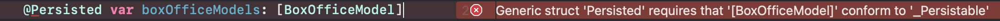

# Trend Media 1030

[1017 버전 README](1017README.md)<br>
[1018 버전 README](1018README.md)<br>
[1019 버전 README](1019README.md)<br>
[1020 버전 README](1020README.md)<br>
[1027 버전 README](1027README.md)<br>
[1028 버전 README](1028README.md)<br>
[1029 버전 README](1029README.md)<br>

# 영진원 박스오피스 데이터에 Realm 적용
- 이미 불러온 적이 있는 박스오피스 정보는 API를 요청하지 않고, 데이터 베이스에서 불러온다.

# Realm모델 작성
```Swift
class BoxOfficeModel: EmbeddedObject {
  @Persisted var rank: String
  @Persisted var title: String
  @Persisted var pubDate: String
  
  convenience init(rank: String, title: String, pubDate: String) {
    self.init()
    self.rank = rank
    self.title = title
    self.pubDate = pubDate
  }
}

class BoxOfficeHistory: Object {
  @Persisted(indexed: true) var targetDate: String
  @Persisted var boxOfficeModels: List<BoxOfficeModel>
  
  convenience init(targetDate: String, boxOfficeModels: [BoxOfficeModel]) {
    self.init()
    self.targetDate = targetDate
    self.boxOfficeModels.append(objectsIn: boxOfficeModels)
  }
}
```
- 커스탬 객체인 `BoxOfficeModel`을 `BoxOfficeHistory`에서 날짜에 맞게 배열로 가지고 싶은데 일반적인 Array로는 저장이 안됐다.

- 애초에 Realm 데이터 모델이 정해져있고, Array 객체를 쓰고 싶으면 List로 선언을 해야 한다.
- 그리고 커스텀 객체를 List로 선언하려면 커스텀 객체가 `RealmCollectionValue` 프로토콜을 채용해야 하는데 이는 `Object`이거나, `EmbeddedObject`이면 된다. 둘 차이는 정확하게 이해하지 못했는데,
>An embedded object is a special type of Realm object that models complex data about a specific object. Embedded objects are similar to relationships, but they provide additional constraints and map more naturally to the denormalized MongoDB document model.

우선은 이게 좀더 최적화 된다고 이해하면 되는 것일까, 

# ViewController
```Swift
  let localRealm = try! Realm()
  var boxOfficeHistory: Results<BoxOfficeHistory>!
  var dayBoxOffice: [BoxOfficeModel] = [] {
    didSet {
      tableView.reloadSections(.init(integer: 0), with: .automatic)
    }
  }
```
- Realm 관련된 프로퍼티는 우선 위와같이 선언

- viewDidLoad에서는 바로 하루 전 날짜를 기준으로 검색을 요청한다.
```Swift
@IBAction func searchBoxOffice() {
    if let date = dateFormaatter.date(from: searchField.text ?? "") {
      let stringDate = dateFormaatter.string(from: date)
      let searchDate = boxOfficeHistory.filter("targetDate = %@", stringDate)
      
      if searchDate.isEmpty {
        fetchBoxOfficeDate(queryDate: stringDate) { [weak self] code, json in
          guard let self = self else { return }
          switch code {
          case 200:
            var tempDayBoxOffice: [BoxOfficeModel] = []
            
            json["boxOfficeResult"]["dailyBoxOfficeList"].arrayValue.forEach { boxOffice in
              let movie = BoxOfficeModel(rank: boxOffice["rank"].stringValue,
                                         title: boxOffice["movieNm"].stringValue,
                                         pubDate: boxOffice["openDt"].stringValue.count < 10
                                         ? "미개봉"
                                         : boxOffice["openDt"].stringValue)
              tempDayBoxOffice.append(movie)
            }
            DispatchQueue.main.async {
              try! self.localRealm.write {
                let history: BoxOfficeHistory = .init(targetDate: stringDate, boxOfficeModels: tempDayBoxOffice)
                self.localRealm.add(history)
              }
              self.dayBoxOffice = self.boxOfficeHistory.filter("targetDate = %@", stringDate)[0].boxOfficeModels.map{$0}
            }
          default:
            print(code, json)
          }
        }
      } else {
        dayBoxOffice = boxOfficeHistory.filter("targetDate = %@", stringDate)[0].boxOfficeModels.map{$0}
      }
    } else {
      print("alert yyyyMMdd!!")
    }
  }
}
```
- 코드가 긴데 핵심만 요약하자면
- boxOfficeHistory에 해당 날짜로 필터링 했을 때 나오는 결과값이 없으면 API에 요청해서 새로운 데이터를 가져오고 이를 저장한다., 그리고 dayBoxOffice 배열에 넘겨준다.
```Swift
self.dayBoxOffice = self.boxOfficeHistory.filter("targetDate = %@", stringDate)[0].boxOfficeModels.map{$0}
```
- 이 코드를 몰라서 한참 고생했다. boxOfficeModels까지 작성하면 Realm Model에서 작성한대로 List<BoxOfficeModel>이 나오는데 이를 배열에다가 적용시킬려고 별짓을 다했다. 그냥 순순히 검색 했어야 했다.
