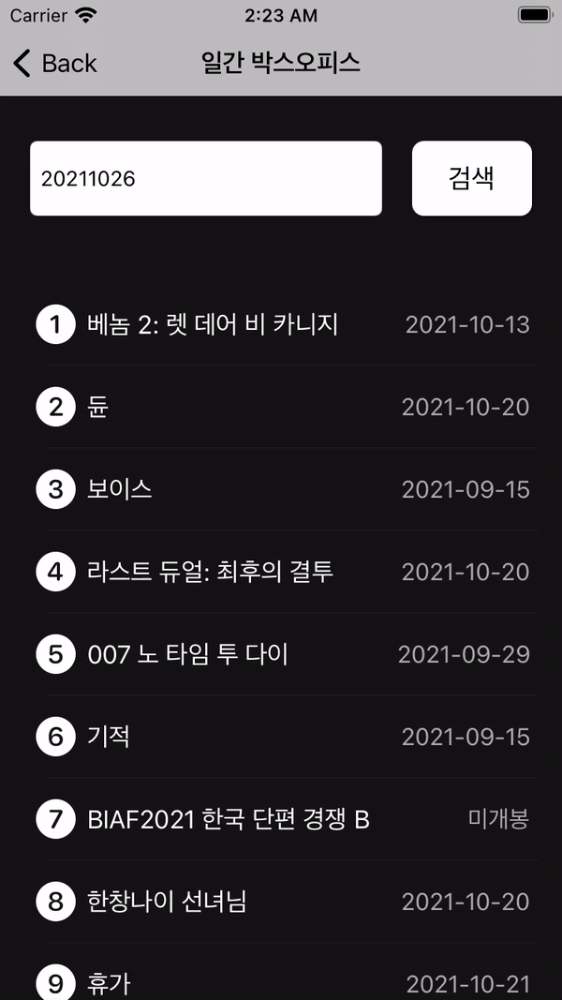
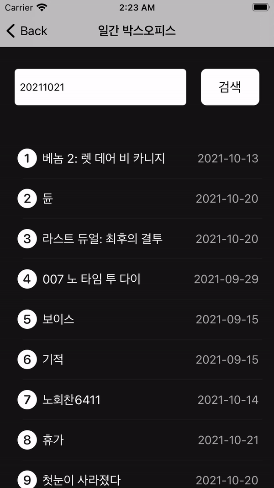

# Trend Media 1020

[1017 버전 README](1017README.md)<br>
[1018 버전 README](1018README.md)<br>
[1019 버전 README](1019README.md)<br>
[1020 버전 README](1020README.md)<br>

# UI 구성

|Move In|Select|DateChange|
|:-:|:-:|:-:|
||||

## 변경점
### 1. 일간 박스오피스 뷰 추가
### 2. 날짜를 입력받고 통신으로 일간 박스오피스 정보를 가져옴
```Swift
  func fetchBoxOfficeDate(queryDate: String) {
    guard let url = getURL(date: queryDate) else {fatalError("URL Build Failure")}
    
    let request = URLRequest(url: url)
    
    URLSession.shared.dataTask(with: request) { data, response, error in
      if let error = error {
        print(error.localizedDescription)
      }
      if let data = data, let response = response {
        if let httpResponse = response as? HTTPURLResponse {
          if httpResponse.statusCode == 200 {
            let json = JSON(data)
            
            var tempDayBoxOffice: [BoxOfficeModel] = []
            
            json["boxOfficeResult"]["dailyBoxOfficeList"].arrayValue.forEach { receive in
              let moive = BoxOfficeModel(rank: receive["rank"].stringValue,
                                         title: receive["movieNm"].stringValue,
                                         pubDate: receive["openDt"].stringValue.count < 10 ? "미개봉" : receive["openDt"].stringValue)
              tempDayBoxOffice.append(moive)
            }
            
            DispatchQueue.main.async {
              self.dayBoxOffice = tempDayBoxOffice
            }
          }
        }
      }
    }.resume()
  }
```
- Alamofire랑 SwiftyJSON을 안쓰고 싶었는데 URLSession은 그럭저럭 됐는데 계층이 복잡하니까 JSONDecoder로 다 해내지 못하겠다. 인코딩은 가능한데, 디코딩은 조금 다른 것 같다.
- StatusCode가 500일 때 서버 정보를 불러올 수 없습니다 라는 별도의 셀 표시 하면 좋을 듯

### 3. 뷰 진입시 항상 최신 날짜의 박스오피스 정보를 먼저 받아옴
```Swift
  override func viewDidLoad() {
    super.viewDidLoad()

    title = "일간 박스오피스"
    dateFormaatter.dateFormat = "yyyyMMdd"
    let yesterday = Date(timeIntervalSinceNow: -(60 * 60 * 24))
    searchField.text = dateFormaatter.string(from: yesterday)
    searchBoxOffice()
  }
```
- viewDidLoad에서 date에다가 하루 전으로 계산해서 넣어준 뒤 호출함

### 4. 셀 클릭시 반짝거리기
- 셀을 눌렀을 때 바로 `tableView.deselectedRow` 되게 함
```Swift

  let selectedView: UIView = {
    let selectedView = UIView(frame: .zero)
    selectedView.backgroundColor = .white.withAlphaComponent(0.5)
    selectedView.layer.cornerRadius = 8
    return selectedView
  }()
  
  override func awakeFromNib() {
    super.awakeFromNib()
    
    selectedBackgroundView = selectedView
    
  }
  